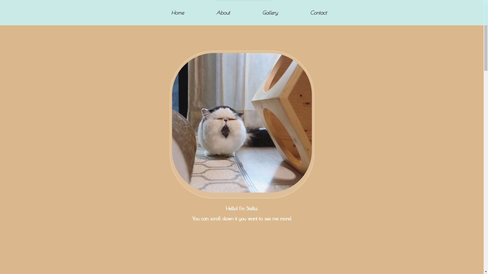
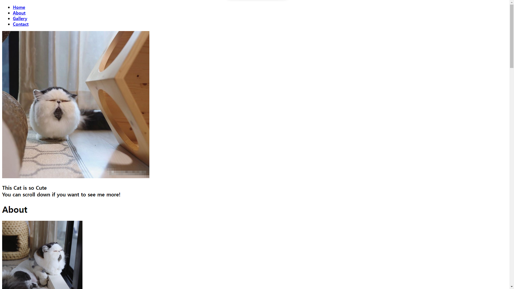
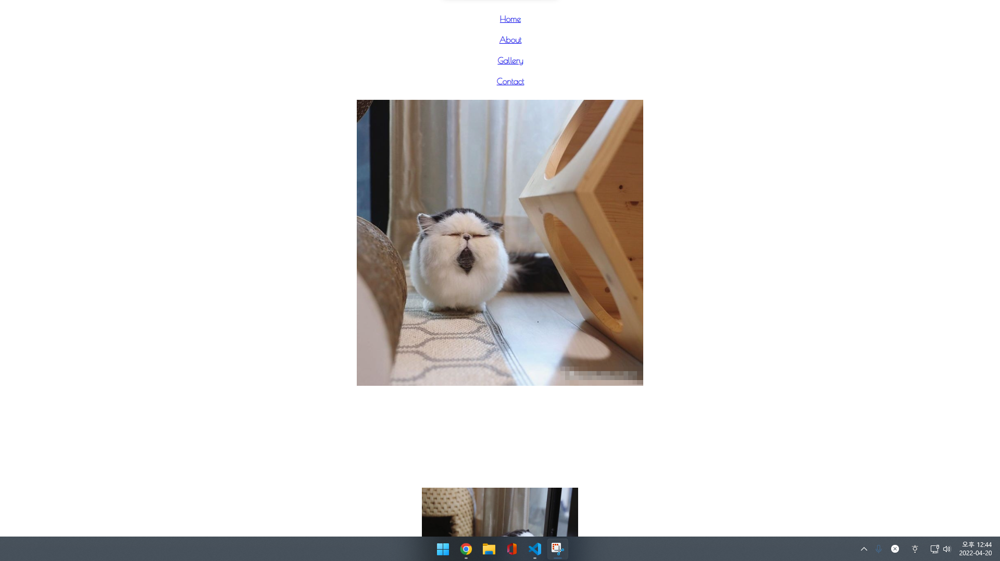
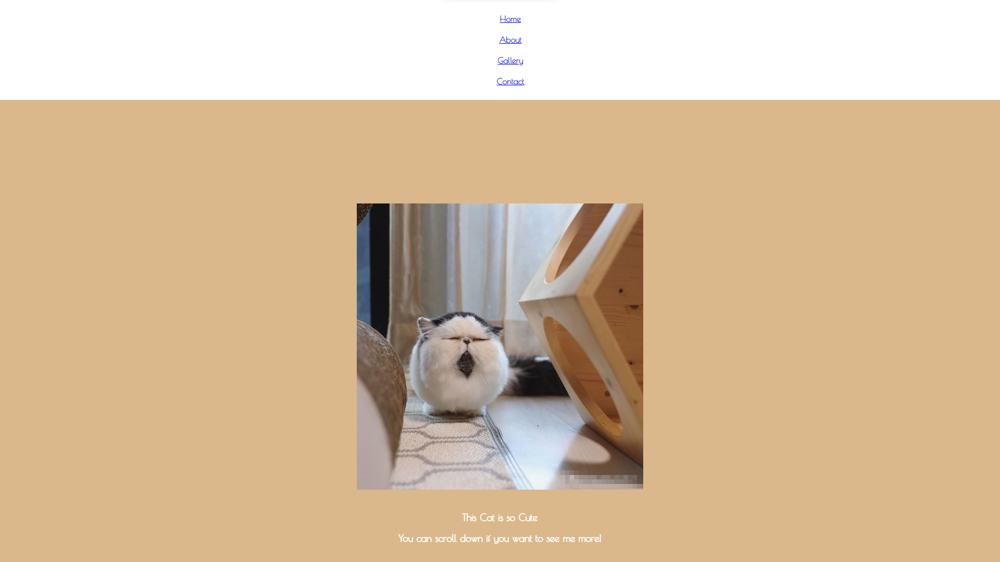
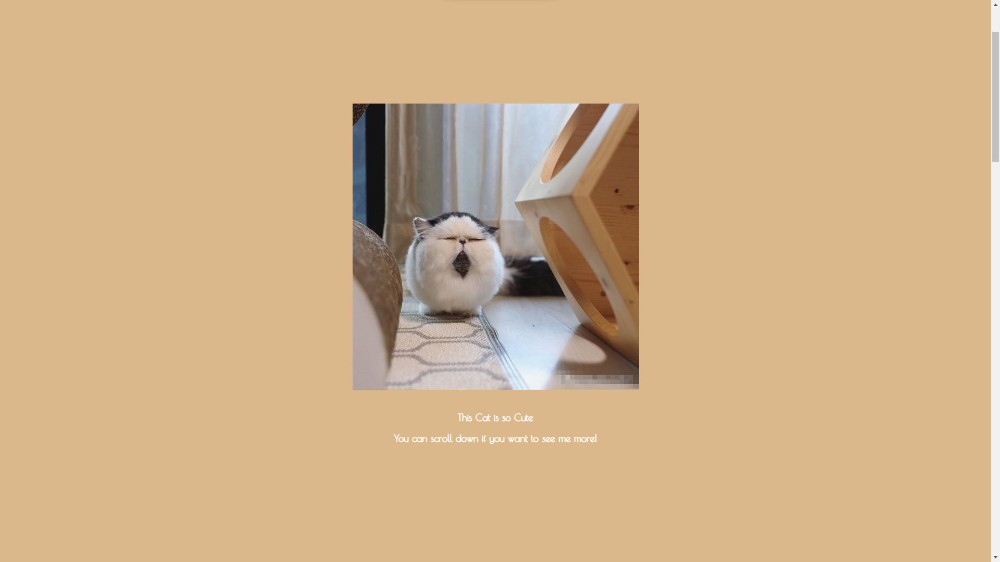
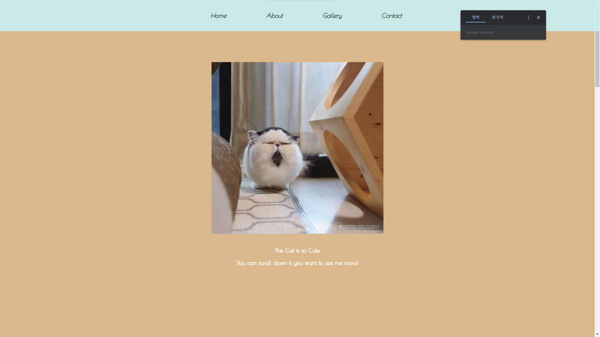
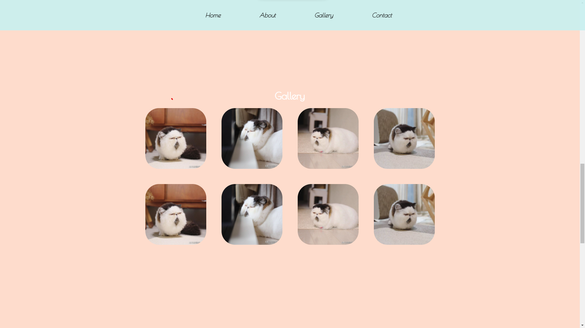
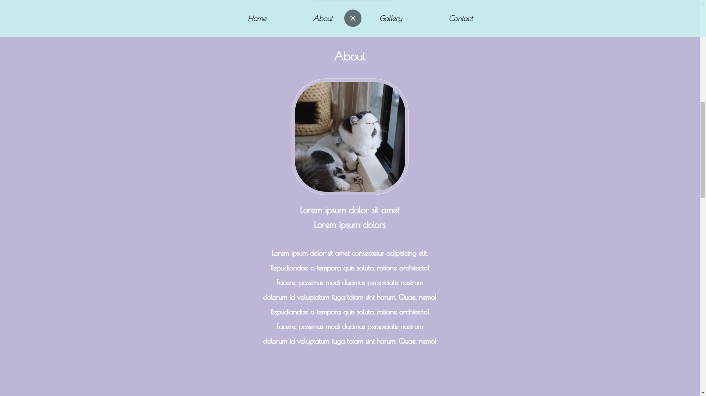
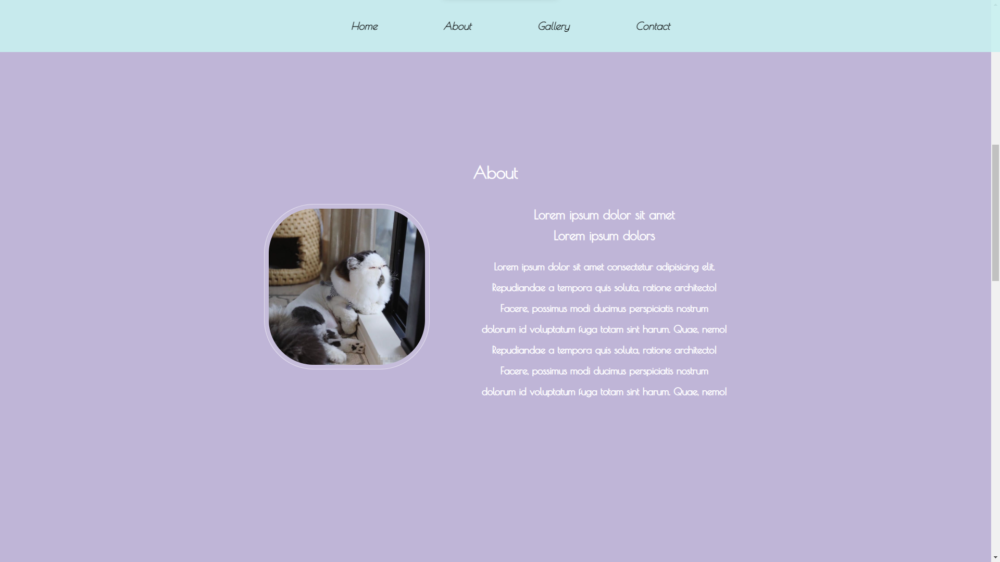
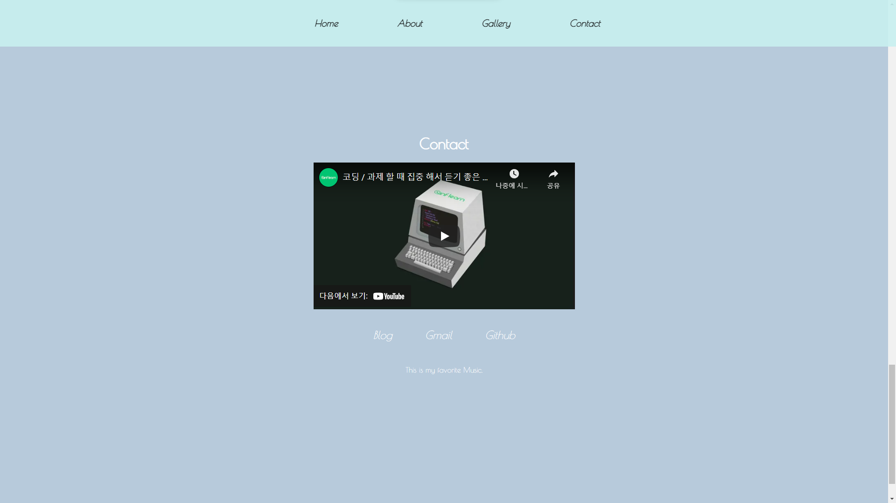

# CSS 프로젝트

- 우리는 앞서 `HTML,CSS`에 대해서 공부를 했습니다.

- 이제 페이지를 만들고 공부한 내용들을 적용해보도록 하겠습니다.

<p align="center"></p>

## HTML 작업

- 우선 `CSS`를 하기전에 뼈대가 되는 `HTML`을 만들 필요가 있습니다.

- 그리고 사전에 원하는 이미지들을 저장해서 넣어줄 필요가 있습니다.

- 사진을 넣는 폴더 위치는 `static`폴더 안에 `imgs`폴더를 만들고 그안에 사진들을 넣어 주시면 됩니다.

```html

<!DOCTYPE html>
<html lang="en">
<head>
    <meta charset="UTF-8">
    <meta http-equiv="X-UA-Compatible" content="IE=edge">
    <meta name="viewport" content="width=device-width, initial-scale=1.0">
    <link rel = "stylesheet" href = "../../static/CSS/main.css">
    <title>PortFolio</title>
</head>
<body>

    <!-- 전체 감싸는 태그 -->
    <div id="container">
        <!-- 네비게이션 태그  -->
        <nav>
            <ul>
                <li><a href = "#Home"><b>Home</b></a></li>
                <li><a href = "#About"><b>About</b></a></li>
                <li><a href = "#Gallery"><b>Gallery</b></a></li>
                <li><a href = "#Contact"><b>Contact</b></a></li>
            </ul>
        </nav>

        <!-- 컨텐츠 시작  -->

        <!-- 첫번째 페이지  -->
        <div id="Home" class="listItem">
            <h1> Home </h1>
            <span class="profile">
                <!-- 이미지 크기 550X550px -->
                
            </span>
            <h3>
                <strong>This Cat is so Cute</strong>
                <br>You can scroll down if you want to see me more!
            </h3>
        </div>

        <!-- 두번째 페이지  -->
           <div id="About" class="listItem">
            <h1> About </h1>
            <div>
            <!-- 이미지 크기 300X300px -->
               
                <div class="AboutContents">
                    <h2>
                        <strong>Lorem ipsum dolor sit amet <br>Lorem ipsum dolors</strong>
                    </h2>
                    <h3 class ="intext">
                        Lorem ipsum dolor sit amet consectetur adipisicing elit.<br>
                        Repudiandae a tempora quis soluta, ratione architecto!<br>
                        Facere, possimus modi ducimus perspiciatis nostrum<br>
                        dolorum id voluptatum fuga totam sint harum. Quae, nemo!<br>
                        Repudiandae a tempora quis soluta, ratione architecto!<br>
                        Facere, possimus modi ducimus perspiciatis nostrum<br>
                        dolorum id voluptatum fuga totam sint harum. Quae, nemo!<br>
                    </h3>
                </div>
             </div>
        </div>
        <!-- 세번째 페이지  -->
        <div id="Gallery" class="listItem">
            <h1> Gallery  </h1>
            <div class = "favorites">
                <div class="GalleryItems">
                    
                    
                    
                    
                    
                    
                    
                    
                </div>
            </div>
        </div>

        <!-- 네번째 페이지  -->
        <div id="Contact" class="listItem">
            <h1> Contact </h1>
            <iframe width="560" height="315" src="https://www.youtube.com/embed/0xJxgvJO2Xo" title="YouTube video player" frameborder="0" allow="accelerometer; autoplay; clipboard-write; encrypted-media; gyroscope; picture-in-picture" allowfullscreen></iframe>

            <div class="ContactLinkWrapper">
                <a href="ehttps://velog.io/" class="ContactLink">Blog</a>
                <a href="mailtotest@gmail.com/" class="ContactLink">Gmail</a>
                <a href="https://github.com/" class="ContactLink">Github</a>
            </div>
        </div>
        <footer>
            This site is a learning page through Django.
        </footer>
    <div>
</body>
</html>

```

- 위처럼 `HTML`을 작성해주시면 아래와 같이 볼품없는 페이지가 만들어집니다.

<p align="center"></p>

- 그럼 이제 `CSS`파일을 만들고 적용 시켜보도록 하겠습니다.

- `CSS`와 `Font`를 바꾸기 위해 `head`태그 안에 아래 내용을 추가해 주도록 하겠습니다.

```html
·///
<link rel="stylesheet" href="../../static/CSS/main.css" />
<style>
  @import url("https://fonts.googleapis.com/css2?family=Poiret+One&display=swap");
</style>
```

```css
/* body 태그 */
body {
  margin: 0; /* 기본적인 세팅  */

  font-family: "Poiret One", cursive; /* body태그 안에 사용되는 폰트 변경 */
  color: white; /* body태그 안에 폰트 색상 흰색으로 변경 */
  text-align: center; /* body태그 안에 폰트 가운데 정렬*/
}
```

- 위와 같이 작업을 하면 아래 그림처럼 폰트가 흰색이 되고 가운데 정렬이 될것입니다.

<p align="center"></p>

- 폰트가 흰색이 되서 보는데 조금 불편하다고 느끼실 겁니다.

- 이제 영역별로 색을 넣어 보도록 하겠습니다.

```css
/* 내용물들을 감싸는 listItem 설정 */
.listItem {
  display: flex; /* flexbox 설정 */
  flex-direction: column; /* flex 방향 설정을 세로 */
  justify-content: center; /*flex 안에 내용물 수직 가운데 정렬 */
  align-items: center; /*flex 안에 내용물 수평 가운데 정렬 */

  width: 100%; /* 전체 가로길이를 부모 태그의 길이만큼 */
  height: 100vh; /* 높이를 브라우저의 크기 만큼  */

  scroll-snap-align: center; /* 이부분은 스크롤 기능인지만 모르셔도 됩니다 */
}

.listItem:nth-child(2) {
  /* listItem의 두번째 자식 */
  background-color: #dab88b; /*색 변경*/
}

.listItem:nth-child(3) {
  /* listItem의 세번째 자식 */
  background-color: #bfb5d7; /*색 변경*/
}

.listItem:nth-child(4) {
  /* listItem의 네번째 자식 */
  background-color: #fedccc; /*색 변경*/
}

.listItem:nth-child(5) {
  /* listItem의 다섯번째 자식 */
  background-color: #b7cadb; /*색 변경*/
}
```

- 위 코드를 입력할 때 약간의 의문점이 있을수 있습니다.

- 왜 `nth-child(1)`은 사용하 지 않는거지? 라는 의문입니다.

- 그 이유는 `listItem`의 자식은 `nav 태그, 클래스명 Home, 클래스명 About,클래스명 Gallery,클래스명 Contact` 총 다섯 가지 입니다.

- 이 중에서 저는 맨위의 `nav` 태그는 흰색으로 남겨두고 싶어서 정하지 않았습니다.

<p align="center"></p>

- 어라? 근데 스크롤이 되지 않습니다!

- 이 이유는 `id`가 `container`로 되어있는 `div`태그 안에 내용물이 넘쳤으나 이를 어떻게 보여줄지 우리가 정해주지 않아서 발생한 일인데요

- 이부분을 해결해 보도록 하겠습니다.

```css
#container {
  width: 100%; /* 전체 가로길이를 부모 태그의 길이만큼 */
  height: 100vh; /* 높이를 브라우저의 크기 만큼  */
  overflow: auto; /* 안에 내용물들이 너무 많아서 넘어가면 스크롤바가 생기게*/

  /* Scroll Action 밑에 두개는 스크롤과 관련된 기능입니다.*/
  /* 알려주지 않았으나 미관상으로 넣은것이니 추가해주도록 합시다.*/
  scroll-behavior: smooth;
  scroll-snap-type: y mandatory;
}
```

- 이제 스크롤이 되면서 아래나 위쪽으로 어느정도 넘어가면 자동으로 땡겨주는 기능도 넣어 주었습니다.

> 스크롤 기능은 scroll-behavior와 scroll-snap-type에 의해서 이루어 집니다.

<p align="center"></p>

- 하지만 전체적인 크기와 높이는 맞추었지만 세부적으로 맞출 필요가 있습니다.

- 먼저 `nav`의 메뉴부터 조금씩 바꾸어 보도록하겠습니다.

```css
nav {
  display: flex; /* nav를 flex 박스*/
  justify-content: center; /*flex 안에 내용물 수평 가운데 정렬 */
  align-items: center; /*flex 안에 내용물 수직 가운데 정렬 */

  width: 100%; /* 전체 가로길이를 부모 태그의 길이만큼 */
  height: 100px; /* 높이를 100px 크기 만큼  */

  text-align: center; /*폰트 가운데 정렬*/
  font-size: 20px; /* 폰트 크기 20px*/
  font-style: italic; /* 폰트를 이텔릭체로*/

  position: fixed; /*화면에 고정 시키기*/
  background-color: rgba(200, 240, 240, 0.9); /*Background 색 지정과 투명도*/
}

nav li {
  margin: 60px; /* nav 안에 요소들 간에 60px 만큼 간격주기*/
  display: inline; /* box-model을 inline*/
}

nav a {
  color: black; /* a태그의 글자색을 검정으로*/
  text-decoration: none; /*a태그 특유의 밑줄과 파란색 스타일 제거*/
}
```

<p align="center"></p>

- 어느정도 `nav`가 이쁘게 자리 잡은거 같습니다 ( 예쁘지 않다면 죄송합니다 ㅠㅠ)

- 다음은 첫번째 `Home`이라고 되어있는 `profile`을 수정해보록 하겠습니다.

```css
profile {
  padding: 0.5rem; /*패딩의 사이즈를 주어 사진과 테두리 선의 간격을 넓힘*/

  border-radius: 30%; /* 테두리를 동그랗게! */
  text

  margin-top: 20px; /* 위에 내용물이 nav와 닿지 않게 간격 확보 */
  background-color: rgba(255, 255, 255, 0.1); /*사진의 배경을 흰색*/
  border: 1px solid rgb(255, 255, 255, 0.5); /*사진의 테두리를 지정*/
}

.profile img {
  border-radius: 30%; /*사진 테두리를 동그랗게*/
}
```

- 사진의 테두리가 이쁘게 바뀐것을 볼수 있습니다!

<p align="center"></p>

- 이제 `About`페이지를 꾸밀려고 하는데 `Gallery`의 사진들의 사이즈를 지정 하지 않아 넘쳐 `Aobut`페이지를 가리고 있습니다.

- 그럼 `Gallery`부터 관리하고 가도록 하겠습니다.

```css
/*사진들을 담는 레이아웃*/
.GalleryItems {
  display: grid; /*레이아웃을 grid 박스로*/

  grid-template-columns: repeat(4, 1fr); /*가로(1fr == 균등하게 나누어라) 4개*/
  grid-template-rows: repeat(2, 200px); /* 세로(200px) 2개*/
  gap: 50px; /*간격은 50px*/
}
/*사진*/
.grid_item {
  border-radius: 45px; /*사진들을 둥글게*/
  width: 200px; /*가로는 200px*/
  height: 200px; /*세로는 200px*/
}
```

- 이제 넘치던 사진들을 이쁘게 조각조각 담아보았습니다.

<p align="center"></p>

- 다시 두번째 페이지인 `About`을 가보겠습니다.
<p align="center"></p>

- 흠 단편적으로 보았을때 문제가 없어 보이나 맨위에 `Home`과 스타일 이 비슷해 이를 변경해 보도록하겠습니다.

```css
.AboutContents {
  float: right;
  margin-left: 100px;
}
```

<p align="center"></p>

- `float`을 통해 글을 옆에 옮겨 보았습니다.

- 이제 마지막으로 `Contact`를 꾸며보도록 하겠습니다.

```css
.Contact {
  justify-content: center;
  margin-top: 35px;
  text-align: center; /*텍스트 가운데 정렬*/
}

.ContactLinkWrapper {
  display: flex; /*flex box화*/
  flex-direction: row; /*flex 박스 가로정렬 */
}
.ContactLink {
  margin: 35px; /*링크간에 간격 띄우기*/

  font-size: 24px; /* 폰트 사이즈 24px*/
  font-style: italic; /* 폰트 스타일은 이탤릭체 */
  text-decoration: none; /* a태그의 기본적인 속성 제거*/
}

footer {
  background-color: black; /* Background 색상 블랙 */
  width: 100%; /*가로는 전체 100%*/
  height: 100px; /*세로는 100px*/
}
```

- 꾸며진 `Contact`를 보시면 이쁘게 되어있습니다 (아마도? 하하하).
<p align="center"></p>
