# 3. CSS

[3장 실습](./3-2.CSS.md)

- HTML는 정보와 구조화, CSS는 styling의 정의라고 이전에 설명한 바 있습니다.

- 그에 맞추어 간단하게 CSS3를 배워보도록 하겠습니다.

## 목차

- [CSS 기본 문법](#css-기본-문법)
  - [1) 셀렉터 (Selector / 선택자)](#1-셀렉터-selector--선택자)
  - [2) 프로퍼티 (Property / 속성)](#2-프로퍼티-property--속성)
  - [3) 값 (Value / 속성값)](#3-값-value--속성값)
  - [4) HTML과 CSS의 연동](#4-html과-css의-연동)
- [셀렉터](#셀렉터)
  - [1) 태그 셀렉터 (Type Selector)](#1-태그-셀렉터-type-selector)
  - [2) ID 셀렉터 (ID Selector)](#2-id-셀렉터-id-selector)
  - [3) 클래스 셀렉터 (Class Selector)](#3-클래스-셀렉터-class-selector)
  - [4) 복합 셀렉터 (Combinator)](#4-복합-셀렉터-combinator)
  - [5) 가상 클래스 셀렉터 (Pseudo-Class Selector)](#5-가상-클래스-셀렉터-pseudo-class-selector)
- [CSS 프로퍼티 값의 단위](#css-프로퍼티-값의-단위)
  - [1) 키워드](#1-키워드)
  - [2) 크기 단위](#2-크기-단위)
  - [3) 색상 표현 단위](#3-색상-표현-단위)
- [박스 모델](#박스-모델)
  - [1) width / height 프로퍼티](#1-width--height-프로퍼티)
  - [2) margin / padding 프로퍼티](#2-margin--padding-프로퍼티)
  - [3) border 프로퍼티](#3-border-프로퍼티)
- [display, visibility, opacity 프로퍼티](#display-visibility-opacity-프로퍼티)
  - [1) display 프로퍼티](#1-display-프로퍼티)
  - [2) visibility 프로퍼티](#2-visibility-프로퍼티)
  - [3) opacity 프로퍼티](#3-opacity-프로퍼티)
- [백그라운드](#백그라운드)
  - [1) background-image 프로퍼티](#1-background-image-프로퍼티)
  - [2) background-color 프로퍼티](#2-background-color-프로퍼티)
- [폰트와 텍스트](#폰트와-텍스트)
  - [1) font-size 프로퍼티](#1-font-size-프로퍼티)
  - [2) color 프로퍼티](#2-color-프로퍼티)
  - [3) text-overflow 프로퍼티](#3-text-overflow-프로퍼티)
- [요소의 위치 정의](#요소의-위치-정의)
  - [1) position 프로퍼티](#1-position-프로퍼티)
  - [2) z-index 프로퍼티](#2-z-index-프로퍼티)
  - [3) overflow 프로퍼티](#3-overflow-프로퍼티)
- [웹디자인 타이포그래피(Typography)](#웹디자인-타이포그래피typography)
  - [1) CDN(Content Delivery Network) 링크 방식](#1-cdncontent-delivery-network-링크-방식)
  - [2) 서버 폰트 로딩 방식](#2-서버-폰트-로딩-방식)
- [레이아웃](#레이아웃)
  - [1) Header & Navigation Bar](#1-header--navigation-bar)
  - [2) Section & Aside](#2-section--aside)
  - [3) footer](#3-footer)
- [플렉스 박스 레이아웃](#플렉스-박스-레이아웃)
  - [1) Introduction](#1-introduction)
  - [2) Usage](#2-usage)
  - [3) Flexbox container 속성](#3-flexbox-container-속성)
  - [4) Flexbox item 속성](#4-flexbox-item-속성)

## CSS 기본 문법

- 가장 먼저 용어에 대해 알아보도록 합시다.

### 1) 셀렉터 (Selector / 선택자)

- 스타일을 적용하고자 하는 HTML 요소를 선택할 수 있어야 합니다.

- 셀렉터는 스타일을 적용하고자 하는 HTML 요소를 선택하기 위해 CSS에서 제공하는 수단입니다.

- 아래와 같은 구문을 Rule Set(또는 Rule)이라 합니다.

- 아래의 구문은 셀렉터를 통해 모든 h1 요소를 선택한 후 선택된 h1 요소의 스타일을 선언 블록에서 정의하고 있습니다.

<p align="center"></p>

### 2) 프로퍼티 (Property / 속성)

- 셀렉터로 HTML 요소를 선택하고 {} 내에 프로퍼티(속성)와 값을 지정하는 것으로 다양한 style을 정의할 수 있습니다.

- 프로퍼티는 표준 스펙으로 이미 지정되어 있는 것을 사용하여야하며 사용자가 임의로 정의할 수 없습니다.

- 여러 개의 프로퍼티를 연속해서 지정할 수 있으며 세미콜론(;)으로 구분합니다.

```css
p {
  color: ...;
  font-size: ...;
}
```

### 3) 값 (Value / 속성값)

- 셀렉터로 지정한 HTML 요소에 style을 적용하기 위해 프로퍼티를 사용했습니다.

- 프로퍼티의 값은 해당 프로퍼티에 사용할 수 있는 값을 “키워드”나 “크기 단위” 또는 “색상 표현 단위” 등의 특정 단위로 지정하여야 합니다.

```css
p {
  color: orange;
  font-size: 16px;
}
```

### 4) HTML과 CSS의 연동

- HTML은 CSS를 포함할 수 있습니다. CSS를 가지고 있지 않은 HTML은 브라우저에서 기본으로 적용하는 CSS(user agent stylesheet)에 의해 렌더링됩니다.

- CSS와 HTML을 연동하는 방법은 다음과 같습니다.

  - Link style : HTML에서 외부에 있는 CSS 파일을 로드하는 방식입니다. 가장 일반적으로 사용된니다.

    ```html
    <!-- templates\Landiang\index.html -->
    <!DOCTYPE html>
    <html>
      <head>
        <link rel="stylesheet" href="/static/css/style.css" />
      </head>
      <body>
        <h1>Hello World</h1>
        <p>This is a web page.</p>
      </body>
    </html>
    ```

    ```css
    <!-- static/css/style.css 파일을 생성하고 밑과 같이 작성합니다. -- > h1 {
      color: red;
    }
    p {
      background: aqua;
    }
    ```

    <p align="center"></p>

  - Embedding style : HTML 내부에 CSS를 포함시키는 방식입니다.

    ```html
    <!DOCTYPE html>
    <html>
      <head>
        <style>
          h1 {
            color: red;
          }
          p {
            background: aqua;
          }
        </style>
      </head>
      <body>
        <h1>Hello World</h1>
        <p>This is a web page.</p>
      </body>
    </html>
    ```

  - Inline style : HTML요소의 style 프로퍼티에 CSS를 기술하는 방식입니다.

    ```html
    <!DOCTYPE html>
    <html>
      <body>
        <h1 style="color: red">Hello World</h1>
        <p style="background: aqua">This is a web page.</p>
      </body>
    </html>
    ```

## 셀렉터

- 위에 기술할 [셀렉터](#1-셀렉터-selector--선택자)의 사용법을 알아보도록 하겠습니다.

### 1) 태그 셀렉터 (Type Selector)

|  패턴  |            Description             |
| :----: | :--------------------------------: |
| 태그명 | 지정된 태그명을 가지는 요소를 선택 |

- 지정된 태그명을 가지는 요소를 선택합니다.

```html
<!DOCTYPE html>
<html>
  <head>
    <style>
      /* 모든 p 태그 요소를 선택 */
      p {
        color: red;
      }
    </style>
  </head>
  <body>
    <h1>Heading</h1>
    <div>
      <p>paragraph 1</p>
      <p>paragraph 2</p>
    </div>
    <p>paragraph 3</p>
  </body>
</html>
```

<p align="center"></p>

### 2) ID 셀렉터 (ID Selector)

|       패턴        |                                          Description                                          |
| :---------------: | :-------------------------------------------------------------------------------------------: |
| #id 어트리뷰트 값 | id 어트리뷰트 값을 지정하여 일치하는 요소를 선택(id 어트리뷰트 값은 중복될 수 없는 유일한 값) |

```html
<!DOCTYPE html>
<html>
  <head>
    <style>
      /* id 어트리뷰트 값이 p1인 요소를 선택 */
      #p1 {
        color: red;
      }
    </style>
  </head>
  <body>
    <h1>Heading</h1>
    <div class="container">
      <p id="p1">paragraph 1</p>
      <p id="p2">paragraph 2</p>
    </div>
    <p>paragraph 3</p>
  </body>
</html>
```

<p align="center"></p>

### 3) 클래스 셀렉터 (Class Selector)

|         패턴         |                                     Description                                      |
| :------------------: | :----------------------------------------------------------------------------------: |
| .class 어트리뷰트 값 | class 어트리뷰트 값을 지정하여 일치하는 요소를 선택(class 어트리뷰트 값은 중복 가능) |

```html
<!DOCTYPE html>
<html>
  <head>
    <style>
      /* class 어트리뷰트 값이 container인 모든 요소를 선택 */
      /* color 어트리뷰트는 자식 요소에 상속된다. */
      .container {
        color: red;
      }
      /* not supported in IE */
      #p2 {
        color: initial;
      }
    </style>
  </head>
  <body>
    <h1>Heading</h1>
    <div class="container">
      <p id="p1">paragraph 1</p>
      <p id="p2">paragraph 2</p>
    </div>
    <p>paragraph 3</p>
  </body>
</html>
```

<p align="center"></p>

- HTML 요소에 class 어트리뷰트 값은 공백으로 구분하여 여러 개 지정할 수 있습니다!

- 아래와 같이 클래스 셀렉터를 사용하여 미리 스타일을 정의해 두고, HTML 요소는 이미 정의되어 있는 클래스를 지정하는 것으로 필요한 스타일을 지정할 수 있습니다.

- 이것은 재사용의 측면에서 유용하다.

<p align="center">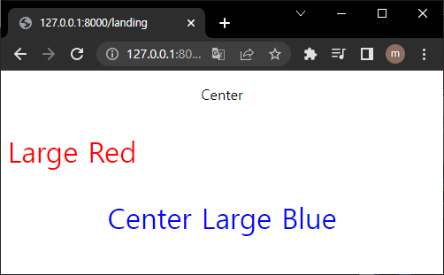</p>

### 4) 복합 셀렉터 (Combinator)

- 자신의 1 level 상위에 속하는 요소를 부모 요소, 1 level 하위에 속하는 요소를 자손 요소(자식 요소)라합니다.

- 자신보다 n level 하위에 속하는 요소는 후손 요소(하위 요소)라 합니다.

<p align="center"></p>

- 후손 셀렉터 (Descendant Combinator)

  - 후손 셀렉터는 셀렉터A의 모든 후손(하위) 요소 중 셀렉터B와 일치하는 요소를 선택합니다.

  |      패턴       |                           Description                            |
  | :-------------: | :--------------------------------------------------------------: |
  | 셀렉터A 셀렉터B | 셀렉터A의 모든 후손(하위) 요소 중 셀렉터B와 일치하는 요소를 선택 |

  ```html
  <!DOCTYPE html>
  <html>
    <head>
      <style>
        /* div 요소의 후손요소 중 p 요소 */
        div p {
          color: red;
        }
      </style>
    </head>
    <body>
      <h1>Heading</h1>
      <div>
        <p>paragraph 1</p>
        <p>paragraph 2</p>
        <span><p>paragraph 3</p></span>
      </div>
      <p>paragraph 4</p>
    </body>
  </html>
  ```

  <p align="center">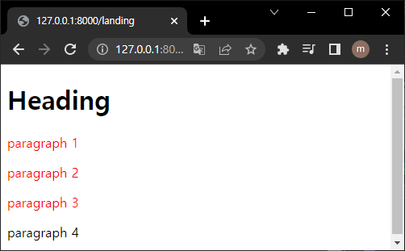</p>

- 자식 셀렉터 (Child Combinator)

  - 자손 셀렉터는 셀렉터A의 모든 자식 요소 중 셀렉터B와 일치하는 요소를 선택합니다.

  |       패턴        |                        Description                         |
  | :---------------: | :--------------------------------------------------------: |
  | 셀렉터A > 셀렉터B | 셀렉터A의 모든 자식 요소 중 셀렉터B와 일치하는 요소를 선택 |

  ```html
  <!DOCTYPE html>
  <html>
    <head>
      <style>
        /* div 요소의 자식요소 중 p 요소 */
        div > p {
          color: red;
        }
      </style>
    </head>
    <body>
      <h1>Heading</h1>
      <div>
        <p>paragraph 1</p>
        <p>paragraph 2</p>
        <span><p>paragraph 3</p></span>
      </div>
      <p>paragraph 4</p>
    </body>
  </html>
  ```

  <p align="center"></p>

### 5) 가상 클래스 셀렉터 (Pseudo-Class Selector)

- 가상 클래스는 요소의 특정 상태에 따라 스타일을 정의할 때 사용됩니다.

- 특정 상태란 예를 들어 다음과 같습니다.

  - 마우스가 올라와 있을 때

  - 링크를 방문했을 때와 아직 방문하지 않았을 때

  - 포커스가 들어와 있을 때

  - 요소의 위치를 보고 판단할 때

- 이러한 특정 상태에는 원래 클래스가 존재하지 않지만 가상 클래스를 임의로 지정하여 선택하는 방법입니다.

- 가상 클래스는 마침표(.) 대신 콜론(:)을 사용합니다. CSS 표준에 의해 미리 정의된 이름이 있기 때문에 임의의 이름을 사용할 수 없습니다.

```css
selector:pseudo-class {
  property: value;
}
```

- 저희는 이중 요소의 위치를 보고 판단하는 것을 중점적으로 다룰 것입니다.

  - 구조 가상 클래스 셀렉터(Structural pseudo-classes)

    | pseudo-class |                       Description                        |
    | :----------: | :------------------------------------------------------: |
    | :first-child | 셀렉터에 해당하는 모든 요소 중 첫번째 자식인 요소를 선택 |
    | :last-child  | 셀렉터에 해당하는 모든 요소 중 마지막 자식인 요소를 선택 |

    ```html
    <!DOCTYPE html>
    <html>
      <head>
        <style>
          /* p 요소 중에서 첫번째 자식을 선택 */
          p:first-child {
            color: red;
          }

          /* p 요소 중에서 마지막 자식을 선택 */
          /* body 요소의 두번째 p 요소는 마지막 자식 요소가 아니다.
    			body 요소의 마지막 자식 요소는 div 요소이다. */
          p:last-child {
            color: blue;
          }
        </style>
      </head>
      <body>
        <p>This paragraph is the first child of its parent (body).</p>

        <h1>Welcome to My Homepage</h1>
        <p>This paragraph is not the first child of its parent.</p>

        <div>
          <p>This paragraph is the first child of its parent (div).</p>
          <p>This paragraph is not the first child of its parent.</p>
        </div>
      </body>
    </html>
    ```

    <p align="center"></p>

    |    pseudo-class    |                          Description                           |
    | :----------------: | :------------------------------------------------------------: |
    |   :nth-child(n)    | 셀렉터에 해당하는 모든 요소 중 앞에서 n번째 자식인 요소를 선택 |
    | :nth-last-child(n) | 셀렉터에 해당하는 모든 요소 중 뒤에서 n번째 자식인 요소를 선택 |

    ```html
    <!DOCTYPE html>
    <html>
      <head>
        <style>
          /* ol 요소의 자식 요소인 li 요소 중에서 짝수번째 요소만을 선택 */
          ol > li:nth-child(2n) {
            color: orange;
          }
          /* ol 요소의 자식 요소인 li 요소 중에서 홀수번째 요소만을 선택 */
          ol > li:nth-child(2n + 1) {
            color: green;
          }

          /* ol 요소의 자식 요소인 li 요소 중에서 첫번쨰 요소만을 선택 */
          ol > li:first-child {
            color: red;
          }
          /* ol 요소의 자식 요소인 li 요소 중에서 마지막 요소만을 선택 */
          ol > li:last-child {
            color: blue;
          }

          /* ol 요소의 자식 요소인 li 요소 중에서 4번째 요소 요소만을 선택 */
          ol > li:nth-child(4) {
            background: brown;
          }

          /* ul 요소의 모든 자식 요소 중에서 뒤에서부터 시작하여 홀수번째 요소만을 선택 */
          ul > :nth-last-child(2n + 1) {
            color: red;
          }
          /* ul 요소의 모든 자식 요소 중에서 뒤에서부터 시작하여 짝수번째 요소만을 선택 */
          ul > :nth-last-child(2n) {
            color: blue;
          }
        </style>
      </head>
      <body>
        <ol>
          <li>Espresso</li>
          <li>Americano</li>
          <li>Caffe Latte</li>
          <li>Caffe Mocha</li>
          <li>Caramel Latte</li>
          <li>Cappuccino</li>
        </ol>

        <ul>
          <li>Espresso</li>
          <li>Americano</li>
          <li>Caffe Latte</li>
          <li>Caffe Mocha</li>
          <li>Caramel Latte</li>
          <li>Cappuccino</li>
        </ul>
      </body>
    </html>
    ```

    <p align="center"></p>

- 전체 표를 정리해보겠습니다!

|         패턴         |                                          Description                                          |
| :------------------: | :-------------------------------------------------------------------------------------------: |
|        태그명        |                              지정된 태그명을 가지는 요소를 선택                               |
|  #id 어트리뷰트 값   | id 어트리뷰트 값을 지정하여 일치하는 요소를 선택(id 어트리뷰트 값은 중복될 수 없는 유일한 값) |
| .class 어트리뷰트 값 |     class 어트리뷰트 값을 지정하여 일치하는 요소를 선택(class 어트리뷰트 값은 중복 가능)      |
|   셀렉터A 셀렉터B    |               셀렉터A의 모든 후손(하위) 요소 중 셀렉터B와 일치하는 요소를 선택                |
|  셀렉터A > 셀렉터B   |                  셀렉터A의 모든 자식 요소 중 셀렉터B와 일치하는 요소를 선택                   |

|    pseudo-class    |                          Description                           |
| :----------------: | :------------------------------------------------------------: |
|    :first-child    |    셀렉터에 해당하는 모든 요소 중 첫번째 자식인 요소를 선택    |
|    :last-child     |    셀렉터에 해당하는 모든 요소 중 마지막 자식인 요소를 선택    |
|   :nth-child(n)    | 셀렉터에 해당하는 모든 요소 중 앞에서 n번째 자식인 요소를 선택 |
| :nth-last-child(n) | 셀렉터에 해당하는 모든 요소 중 뒤에서 n번째 자식인 요소를 선택 |

## CSS 프로퍼티 값의 단위

- CSS 프로퍼티에는 키워드, 크기 단위, 색상 표현 단위 등의 특정 단위를 갖는 값을 지정합니다.[(속성값)](#3-값-value--속성값)

### 1) 키워드

- 각 프로퍼티에 따라 사용할 수 있는 키워드가 존재합니다.

- 예를 들어 display 프로퍼티의 값으로 사용할 수 있는 키워드는 block, inline, inline-block, none이 있습니다.

- 자세한 내용은 각각의 프로퍼티를 참조하시면 됩니다!

### 2) 크기 단위

- cm, mm, inch 등의 단위도 존재하나 CSS에서 사용하는 대표적인 크기 단위는 px, em, %입니다.

- px은 절대값이고 em, %는 상대값입니다.

- 예하 단위의 상세 설명은 다음과 같습니다.

- px

  - px은 픽셀(화소) 단위입니다. 1px은 화소 1개 크기를 의미합니다.

  - 픽셀은 디바이스 해상도(resolution)에 따라 상대적인 크기를 갖습니다.

  ```html
  <!DOCTYPE html>
  <html>
    <head>
      <style>
        body {
          text-align: center;
        }
        div {
          font-size: 14px;
          font-weight: bold;
          padding: 2em; /* 14px * 2 = 28px */
          background-color: rgba(255, 0, 0, 0.2);
        }
      </style>
    </head>
    <body>
      <div>Font size: 14px</div>
    </body>
  </html>
  ```

  <p align="center"></p>

- %

  - %는 백분률 단위의 상대 단위입니다.

  - 요소에 지정된 사이즈(상속된 사이즈나 디폴트 사이즈)에 상대적인 사이즈를 설정합니다.

  ```html
  <!DOCTYPE html>
  <html>
    <head>
      <style>
        body {
          font-size: 14px;
          text-align: center;
        }
        div {
          font-size: 120%; /* 14px * 1.2 = 16.8px */
          font-weight: bold;
          padding: 2em; /* 16.8px * 2 = 33.6px */
          background-color: rgba(255, 0, 0, 0.2);
        }
      </style>
    </head>
    <body>
      <div>Font size: 14px * 120% → 16.8px</div>
    </body>
  </html>
  ```

  <p align="center"></p>

- em

  - em은 배수(倍數) 단위로 상대 단위입니다.

  - 요소에 지정된 사이즈(상속된 사이즈나 디폴트 사이즈)에 상대적인 사이즈를 설정합니다.

  - 예를 들어 1em은 요소에 지정된 사이즈와 같고 2em은 요소에 지정된 사이즈의 2배입니다.

  ```html
  <!DOCTYPE html>
  <html>
    <head>
      <style>
        body {
          font-size: 14px;
          text-align: center;
        }
        div {
          font-size: 1.2em; /* 14px * 1.2 = 16.8px */
          font-weight: bold;
          padding: 2em; /* 16.8px * 2 = 33.6px */
          background-color: rgba(255, 0, 0, 0.2);
        }
      </style>
    </head>
    <body>
      <div>Font size: 1.2em → 14px * 1.2 = 16.8px</div>
    </body>
  </html>
  ```

  <p align="center">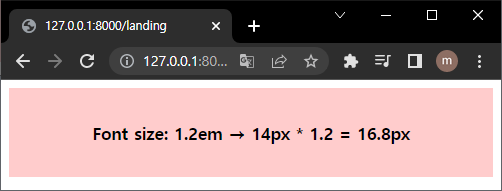</p>

  - 중첩된 자식 요소에 em을 지정하면 모든 자식 요소의 사이즈에 영향을 미치기 때문에 주의하여야 합니다.

  ```html
  <!DOCTYPE html>
  <html>
    <head>
      <style>
        body {
          font-size: 14px;
          text-align: center;
        }
        div {
          font-size: 1.2em; /* 14px * 1.2 = 16.8px */
          font-weight: bold;
          padding: 2em;
        }
        .box1 {
          background-color: rgba(255, 0, 0, 0.2);
        }
        .box2 {
          background-color: rgba(255, 0, 0, 0.6);
        }
        .box3 {
          background-color: rgba(255, 0, 0, 0.8);
        }
      </style>
    </head>
    <body>
      <div class="box1">
        Font size: 1.2em ⇒ 14px * 1.2 = 16.8px
        <div class="box2">
          Font size: 1.2em ⇒ 16.8px * 1.2 = 20.16px
          <div class="box3">Font size: 1.2em ⇒ 20.16px * 1.2 = 24.192px</div>
        </div>
      </div>
    </body>
  </html>
  ```

  <p align="center"></p>

- rem

  - rem은 최상위 요소(html)의 사이즈를 기준으로 삼습니다. rem의 r은 root를 의미합니다.

  ```html
  <!DOCTYPE html>
  <html>
    <head>
      <style>
        html {
          font-size: 14px;
          /* font-size 미지정 시에는 16px */
        }
        div {
          font-size: 1.2rem; /* html font-size: 14px * 1.2 = 16.8px */
          font-weight: bold;
          padding: 2em;
          text-align: center;
        }
        .box1 {
          background-color: rgba(255, 0, 0, 0.2);
        }
        .box2 {
          background-color: rgba(255, 0, 0, 0.6);
        }
        .box3 {
          background-color: rgba(255, 0, 0, 0.8);
        }
      </style>
    </head>
    <body>
      <div class="box1">
        Font size: 1.2rem ⇒ 14px * 1.2 = 16.8px
        <div class="box2">
          Font size: 1.2rem ⇒ 14px * 1.2 = 16.8px
          <div class="box3">Font size: 1.2rem ⇒ 14px * 1.2 = 16.8px</div>
        </div>
      </div>
    </body>
  </html>
  ```

  <p align="center"></p>

  - 사용자가 브라우저의 기본 폰트 크기를 변경에도 웹사이트의 레이아웃을 적절히 조정할 수 있다는 장점이 있습니다.

- viewport 단위(vh, vw, vmin, vmax)

  - 반응형 웹디자인은 화면의 크기에 동적으로 대응하기 위해 % 단위를 자주 사용합니다. 하지만 % 단위는 em과 같이 상속에 의해 부모 요소에 상대적 영향을 받습니다.

  - Viewport 단위는 상대적인 단위로 viewport를 기준으로 한 상대적 사이즈를 의미합니다.

  | 단위 |                Description                 |
  | :--: | :----------------------------------------: |
  |  vw  |           viewport 너비의 1/100            |
  |  vh  |           viewport 높이의 1/100            |
  | vmin | viewport 너비 또는 높이 중 작은 쪽의 1/100 |
  | vmax |  viewport 너비 또는 높이 중 큰 쪽의 1/100  |

  ```html
  <!DOCTYPE html>
  <html>
    <head>
      <style>
        body {
          margin: 0px;
        }
        .item {
          width: 50vw;
          height: 100vh;
          text-align: center;
          line-height: 100vh;
          font-size: 4rem;
          color: white;
        }
        .item1 {
          background-color: red;
        }
        .item2 {
          background-color: orange;
        }
      </style>
    </head>
    <body>
      <div class="item item1">item1</div>
      <div class="item item2">item2</div>
    </body>
  </html>
  ```

  <p align="center"></p>

### 3) 색상 표현 단위

- 색상을 지정하기 위해 키워드(red, blue…)를 사용할 수 있습니다.

- 사용이 간편하다는 장점이 있으나 표현할 수 있는 색상의 수는 제한됩니다.

- 색상를 표현할 수 있는 키워드 리스트는 [W3C css3-color](https://www.w3.org/TR/css-color-3/)를 참고하기 바란다.

```html
<!DOCTYPE html>
<html>
  <body>
    <h2 style="background-color:red">Red background-color</h2>

    <h2 style="background-color:green">Green background-color</h2>

    <h2 style="background-color:blue;color:white">
      Blue background-color and white text color
    </h2>

    <h2 style="background-color:orange">Orange background-color</h2>

    <h2 style="background-color:yellow">Yellow background-color</h2>

    <h2 style="background-color:cyan">Cyan background-color</h2>

    <h2 style="background-color:black;color:white">
      Black background-color and white text color
    </h2>
  </body>
</html>
```

<p align="center">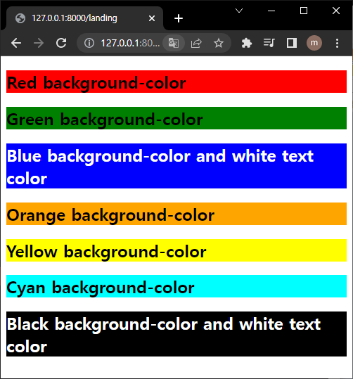</p>

- 더욱 다양한 색상을 표현하기 위해 다음과 같은 색상 표현 단위를 사용할 수 있습니다.

- [HTML COLOR CODES](https://htmlcolorcodes.com/)를 참조하면 편리합니다.

| 단위                                            | Example                |
| :---------------------------------------------- | :--------------------- |
| HEX 코드 단위 (Hexadecimal Colors)              | #000000                |
| RGB (Red, Green, Blue)                          | rgb(255, 255, 0)       |
| RGBA (Red, Green, Blue, Alpha/투명도)           | rgba(255, 255, 0, 1)   |
| HSL (Hue/색상, Saturation/채도, Lightness/명도) | hsl(0, 100%, 25%)      |
| HSLA (Hue, Saturation, Lightness, Alpha)        | hsla(60, 100%, 50%, 1) |

```html
<!DOCTYPE html>
<html>
  <head>
    <style>
      #hex-p1 {
        background-color: #ff0000;
      }
      #hex-p2 {
        background-color: #00ff00;
      }
      #hex-p3 {
        background-color: #0000ff;
      }
      #hex-p4 {
        background-color: #ffff00;
      }
      #hex-p5 {
        background-color: #ff00ff;
      }

      #rgb-p1 {
        background-color: rgb(255, 0, 0);
      }
      #rgb-p2 {
        background-color: rgb(0, 255, 0);
      }
      #rgb-p3 {
        background-color: rgb(0, 0, 255);
      }
      #rgb-p4 {
        background-color: rgb(192, 192, 192);
      }
      #rgb-p5 {
        background-color: rgb(255, 255, 0);
      }
      #rgb-p6 {
        background-color: rgb(255, 0, 255);
      }

      #rgba-p1 {
        background-color: rgba(255, 0, 0, 0.3);
      }
      #rgba-p2 {
        background-color: rgba(0, 255, 0, 0.3);
      }
      #rgba-p3 {
        background-color: rgba(0, 0, 255, 0.3);
      }
      #rgba-p4 {
        background-color: rgba(192, 192, 192, 0.3);
      }
      #rgba-p5 {
        background-color: rgba(255, 255, 0, 0.3);
      }
      #rgba-p6 {
        background-color: rgba(255, 0, 255, 0.3);
      }

      #hsl-p1 {
        background-color: hsl(120, 100%, 50%);
      }
      #hsl-p2 {
        background-color: hsl(120, 100%, 75%);
      }
      #hsl-p3 {
        background-color: hsl(120, 100%, 25%);
      }
      #hsl-p4 {
        background-color: hsl(120, 60%, 70%);
      }
      #hsl-p5 {
        background-color: hsl(290, 100%, 50%);
      }
      #hsl-p6 {
        background-color: hsl(290, 60%, 70%);
      }

      #hsla-p1 {
        background-color: hsla(120, 100%, 50%, 0.3);
      }
      #hsla-p2 {
        background-color: hsla(120, 100%, 75%, 0.3);
      }
      #hsla-p3 {
        background-color: hsla(120, 100%, 25%, 0.3);
      }
      #hsla-p4 {
        background-color: hsla(120, 60%, 70%, 0.3);
      }
      #hsla-p5 {
        background-color: hsla(290, 100%, 50%, 0.3);
      }
      #hsla-p6 {
        background-color: hsla(290, 60%, 70%, 0.3);
      }
    </style>
  </head>

  <body>
    <h1>HEX colors:</h1>
    <p id="hex-p1">Red</p>
    <p id="hex-p2">Green</p>
    <p id="hex-p3">Blue</p>
    <p id="hex-p4">Yellow</p>
    <p id="hex-p5">Cerise</p>

    <h1>RGB colors:</h1>
    <p id="rgb-p1">Red</p>
    <p id="rgb-p2">Green</p>
    <p id="rgb-p3">Blue</p>
    <p id="rgb-p4">Grey</p>
    <p id="rgb-p5">Yellow</p>
    <p id="rgb-p6">Cerise</p>

    <h1>RGB colors with opacity:</h1>
    <p id="rgba-p1">Red</p>
    <p id="rgba-p2">Green</p>
    <p id="rgba-p3">Blue</p>
    <p id="rgba-p4">Grey</p>
    <p id="rgba-p5">Yellow</p>
    <p id="rgba-p6">Cerise</p>

    <h1>HSL colors:</h1>
    <p id="hsl-p1">Green</p>
    <p id="hsl-p2">Light green</p>
    <p id="hsl-p3">Dark green</p>
    <p id="hsl-p4">Pastel green</p>
    <p id="hsl-p5">Violet</p>
    <p id="hsl-p6">Pastel violet</p>

    <h1>HSL colors with opacity:</h1>
    <p id="hsla-p1">Green</p>
    <p id="hsla-p2">Light green</p>
    <p id="hsla-p3">Dark green</p>
    <p id="hsla-p4">Pastel green</p>
    <p id="hsla-p5">Violet</p>
    <p id="hsla-p6">Pastel violet</p>
  </body>
</html>
```

<p align="center"></p>

## 박스 모델

- 모든 HTML 요소는 Box 형태의 영역을 가지고 있습니다.

- Box 형태란 물론 사각형을 의미합니다.

- 이 Box는 콘텐트(Content), 패딩(Padding), 테두리(Border), 마진(Margin)로 구성됩니다.

<p align="center"></p>

- 브라우저는 박스 모델의 크기(dimension)와 프로퍼티(색, 배경, 모양 등), 위치를 근거로 하여 렌더링을 실행합니다.

- 웹디자인은 콘텐츠를 담을 박스 모델을 정의하고 CSS 프로퍼티를 통해 스타일(배경, 폰트와 텍스트 등)과 위치 및 정렬을 지정하는 것이라고 할 수 있습니다.

- Box 모델을 구성하는 콘텐트(Content), 패딩(Padding), 테두리(Border), 마진(Margin)에 대한 설명은 아래와 같습니다.

| 명칭    | 설명                                                                                                                                                                                                    |
| :------ | :------------------------------------------------------------------------------------------------------------------------------------------------------------------------------------------------------ |
| Content | 요소의 텍스트나 이미지 등의 실제 내용이 위치하는 영역이다. width, height 프로퍼티를 갖는다.                                                                                                             |
| Padding | 테두리(Border) 안쪽에 위치하는 요소의 내부 여백 영역이다. padding 프로퍼티 값은 패딩 영역의 두께를 의미하며 기본색은 투명(transparent)이다. 요소에 적용된 배경의 컬러, 이미지는 패딩 영역까지 적용된다. |
| Border  | 테두리 영역으로 border 프로퍼티 값은 테두리의 두께를 의미한다.                                                                                                                                          |
| Margin  | 테두리(Border) 바깥에 위치하는 요소의 외부 여백 영역이다. margin 프로퍼티 값은 마진 영역의 두께를 의미한다. 기본적으로 투명(transparent)하며 배경색을 지정할 수 없다.                                   |

```html
<!DOCTYPE html>
<html>
  <head>
    <style>
      div {
        /* 배경색의 지정: 콘텐츠 영역과 패딩 영역에 적용된다. */
        background-color: lightgrey;
        /* 콘텐츠 영역의 너비 */
        width: 300px;
        /* 패딩 영역의 두께 */
        padding: 25px;
        /* 테두리: 두께 형태 색상 */
        border: 25px solid navy;
        /* 마진 영역의 두께 */
        margin: 25px;
      }
    </style>
  </head>
  <body>
    <h2>Box Model</h2>

    <div>
      Lorem ipsum dolor sit amet, consectetur adipiscing elit, sed do eiusmod
      tempor incididunt ut labore et dolore magna aliqua. Ut enim ad minim
      veniam, quis nostrud exercitation ullamco laboris nisi ut aliquip ex ea
      commodo consequat. Duis aute irure dolor in reprehenderit in voluptate
      velit esse cillum dolore eu fugiat nulla pariatur. Excepteur sint occaecat
      cupidatat non proident, sunt in culpa qui officia deserunt mollit anim id
      est laborum.
    </div>
  </body>
</html>
```

<p align="center">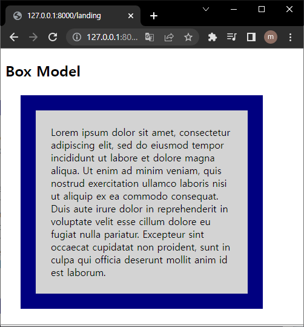</p>

<p align="center"></p>

### 1) width / height 프로퍼티

- width와 height 프로퍼티는 요소의 너비와 높이를 지정하기 위해 사용됩니다.

- 이때 지정되는 요소의 너비와 높이는 콘텐츠 영역을 대상으로 합니다.

- 만일 width와 height로 지정한 콘텐츠 영역보다 실제 콘텐츠가 크면 콘텐츠 영역을 넘치게 된다는 것에 유의하여야 합니다.

```html
<!DOCTYPE html>
<html>
  <head>
    <meta charset="UTF-8" />
    <style>
      div {
        width: 300px;
        height: 100px;
        background-color: cornsilk;
        border: 5px solid navy;
      }
    </style>
  </head>
  <body>
    <div>
      Lorem ipsum dolor sit amet, consectetur adipisicing elit, sed do eiusmod
      tempor incididunt ut labore et dolore magna aliqua. Ut enim ad minim
      veniam, quis nostrud exercitation ullamco laboris nisi ut aliquip ex ea
      commodo consequat. Duis aute irure dolor in reprehenderit in voluptate
      velit esse cillum dolore eu fugiat nulla pariatur. Excepteur sint occaecat
      cupidatat non proident, sunt in culpa qui officia deserunt mollit anim id
      est laborum.
    </div>
  </body>
</html>
```

<p align="center">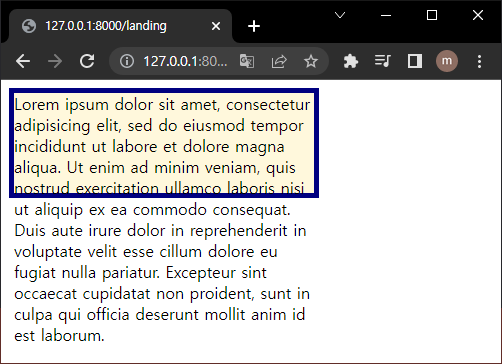</p>

> overflow: hidden;을 지정하면 넘친 콘텐츠를 감출 수 있습니다.

- 전체 너비 계산법

  - width + left padding + right padding + left border + right border + left margin + right margin

- 전체 높이 계산법

  - height + top padding + bottom padding + top border + bottom border + top margin + bottom margin

### 2) margin / padding 프로퍼티

- margin / padding 프로퍼티는 content의 4개 방향(top, right, left, bottom)에 대하여 지정이 가능합니다.

<p align="center"></p>

```html
<!DOCTYPE html>
<html>
  <head>
    <style>
      div {
        border: 5px solid red;

        margin-top: 40px;
        margin-right: 30px;
        margin-bottom: 20px;
        margin-left: 10px;

        padding-top: 10px;
        padding-right: 20px;
        padding-bottom: 30px;
        padding-left: 40px;
      }
    </style>
  </head>
  <body>
    <div>
      Lorem ipsum dolor sit amet, consectetur adipiscing elit, sed do eiusmod
      tempor incididunt ut labore et dolore magna aliqua. Ut enim ad minim
      veniam, quis nostrud exercitation ullamco laboris nisi ut aliquip ex ea
      commodo consequat. Duis aute irure dolor in reprehenderit in voluptate
      velit esse cillum dolore eu fugiat nulla pariatur. Excepteur sint occaecat
      cupidatat non proident, sunt in culpa qui officia deserunt mollit anim id
      est laborum.
    </div>
  </body>
</html>
```

<p align="center"></p>

- -top, -right, -bottom, -left 4방향의 프로퍼티를 각각 지정하지 않고 margin, padding 1개의 프로퍼티만으로 4방향의 프로퍼티를 한번에 지정할 수 있습니다.

### 3) border 프로퍼티

- border는 다음과 같은 프로퍼티를 가지고 있습니다.

- border-style : 테두리 선의 스타일을 지정

- border-width : 테두리의 두께를 지정

- border-color : 테두리의 색상을 지정

- border-radius : 테두리 모서리를 둥글게 표현하도록 지정

- border : 두께, 스타일, 색상 => `p { border : 5px solid red; }`

```html
<!DOCTYPE html>
<html>
  <head>
    <style>
      p {
        border: 5px solid red;
        border-radius: 0.5rem;
      }
    </style>
  </head>
  <body>
    <p>test</p>
  </body>
</html>
```

<p align="center">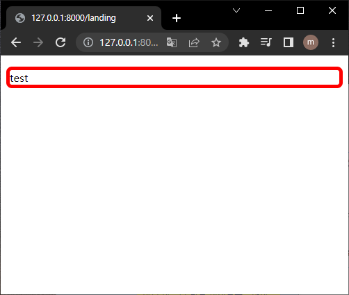</p>

### 4) box-sizing 프로퍼티

- width, height 프로퍼티의 대상 영역을 변경

| 키워드      | 설명                                                                              |
| :---------- | :-------------------------------------------------------------------------------- |
| content-box | width, height 프로퍼티 값은 content 영역을 의미한다. (기본값)                     |
| border-box  | width, height 프로퍼티 값은 content 영역, padding, border가 포함된 값을 의미한다. |

<p align="center"></p>

```html
<!DOCTYPE html>
<html>
  <head>
    <style>
      .box {
        width: 600px;
        border: 10px solid;
        padding: 50px;
        margin: 50px;
        background-color: red;
      }
      .content-box {
        box-sizing: content-box;
      }
      .border-box {
        box-sizing: border-box;
      }
    </style>
  </head>
  <body>
    <div class="box content-box">content-box</div>
    <div class="box border-box">border-box</div>
  </body>
</html>
```

<p align="center">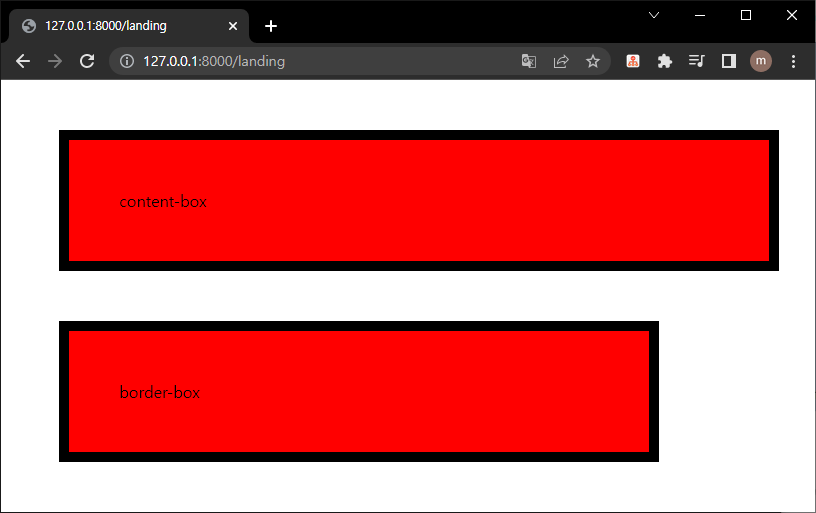</p>

## display, visibility, opacity 프로퍼티

### 1) display 프로퍼티

- display 프로퍼티는 layout 정의에 자주 사용되는 중요한 프로퍼티 입니다.

| 프로퍼티값 키워드 | 설명                                                           |
| :---------------- | :------------------------------------------------------------- |
| block             | block 특성을 가지는 요소(block 레벨 요소)로 지정               |
| inline            | inline 특성을 가지는 요소(inline 레벨 요소)로 지정             |
| inline-block      | inline-block 특성을 가지는 요소(inline-block 레벨 요소)로 지정 |
| none              | 해당 요소를 화면에 표시하지 않는다 (공간조차 사라진다)         |

|                block                |                         inline                          |         inline-block          |
| :---------------------------------: | :-----------------------------------------------------: | :---------------------------: |
|      항상 새로운 라인에서 시작      |             줄을 바꾸지 않고 다음 행에 위치             |         inline과 동일         |
|       화면 전체 가로폭을 차지       |                 content의 너비만큼 차지                 |         inline과 동일         |
| width, height, margin, padding 사용 |                 line_height로 상하 조절                 | block과 inline 동시 적용 가능 |
|  block 안에 inline 포함할 수 있음   |           inline 안에 block이 포함될 수 없음            |               -               |
|                  -                  | inline 요소 뒤에 공백일 경우 space가 자동으로 지정(4px) |         inline과 동일         |
| div h1~h6 p ol ul li hr table form  |    span a strong img br input select textarea button    |               -               |

### 2) visibility 프로퍼티

| 프로퍼티값 키워드 | 설명                                                                                                                                                      |
| :---------------- | :-------------------------------------------------------------------------------------------------------------------------------------------------------- |
| visible           | 해당 요소를 보이게 한다 (기본값)                                                                                                                          |
| hidden            | 해당 요소를 보이지 않게 한다. display: none;은 해당 요소의 공간까지 사라지게 하지만 visibility: hidden;은 해당 요소의 공간은 사라지지 않고 남아있게 된다. |
| collapse          | table 요소에 사용하며 행이나 열을 보이지 않게 한다.                                                                                                       |
| none              | table 요소의 row나 column을 보이지 않게 한다. IE, 파이어폭스에서만 동작하며 크롬에서는 hidden과 동일하게 동작한다.                                        |

### 3) opacity 프로퍼티

- 프로퍼티는 요소의 투명도를 정의합니다

## 백그라운드

- Background 관련 프로퍼티는 해당 요소의 배경으로 이미지 또는 색상을 정의합니다.

### 1) background-image 프로퍼티

- 요소에 배경 이미지를 지정합니다.

```html
<!DOCTYPE html>
<html>
  <head>
    <style>
      body {
        background-image: url("http://poiemaweb.com/img/bg/dot.png");
      }
    </style>
  </head>
  <body>
    <h3>Background Image</h3>
  </body>
</html>
```

<p align="center">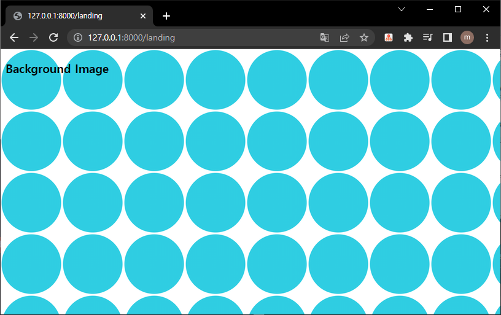</p>

### 2) background-color 프로퍼티

- `background-color` 프로퍼티는 요소의 배경 색상을 지정합니다.

- 색상값 또는 transparent 키워드를 지정할 수 있습니다.

## 폰트와 텍스트

### 1) font-size 프로퍼티

```html
<!DOCTYPE html>
<html>
  <head>
    <style>
      .font-size-40 {
        font-size: 40px;
      }
      .font-size-2x {
        font-size: 2em;
      }
      .font-size-150ps {
        font-size: 150%;
      }
      .font-size-large {
        font-size: large;
      }
    </style>
  </head>
  <body>
    <p>default font size: 16px</p>
    <p class="font-size-40">font-size: 40px</p>
    <p class="font-size-2x">font-size: 2.0em</p>
    <p class="font-size-150ps">font-size: 150%</p>
    <p class="font-size-large">font-size: large</p>
  </body>
</html>
```

<p align="center">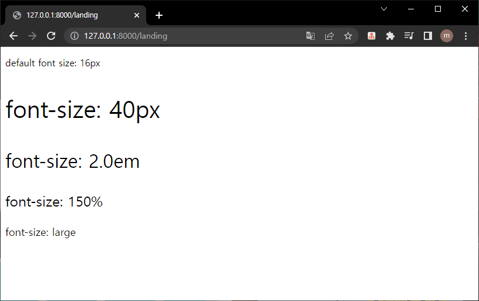</p>

### 2) color 프로퍼티

- 글자의 색상을 지정해주는 프로퍼티입니다.

### 3) text-overflow 프로퍼티

```html
<!DOCTYPE html>
<html>
  <head>
    <meta charset="utf-8" />
    <style>
      div {
        font-size: 2rem;
        width: 150px;
        color: red;
        white-space: nowrap; /* 자동 줄바꿈을 방지 */
        overflow: hidden; /* 반드시 "visible" 이외의 값이 지정되어 있어야 한다. */
      }
      .ellipsis {
        text-overflow: ellipsis;
      }
      .clip {
        text-overflow: clip;
      }
    </style>
  </head>
  <body>
    <div class="ellipsis">
      Lorem ipsum dolor sit amet consectetur adipisicing elit.
    </div>
    <div class="clip">
      Lorem ipsum dolor sit amet consectetur adipisicing elit.
    </div>
  </body>
</html>
```

<p align="center">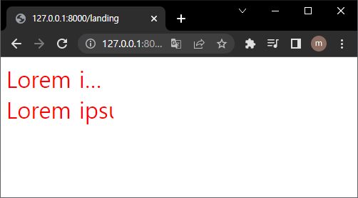</p>

## 요소의 위치 정의

### 1) position 프로퍼티

| static                           | relative                                | absolute                                    | fixed     |
| :------------------------------- | :-------------------------------------- | :------------------------------------------ | :-------- |
| 기본 위치                        | 상대 위치                               | 절대 위치                                   | 고정 위치 |
| 부모 요소의 위치를 기준으로 배치 | 좌표 프로퍼티의 동작 여부에 영향을 받음 | document body를 기준으로 하여 좌표 프로퍼티 |

- static (기본위치)

  - static은 position 프로퍼티의 기본값으로 position 프로퍼티를 지정하지 않았을 때와 같습니다.

  - 기본적인 요소의 배치 순서에 따라 위에서 아래로, 왼쪽에서 오른쪽으로 순서에 따라 배치되며 부모 요소 내에 자식 요소로서 존재할 때는 부모 요소의 위치를 기준으로 배치됩니다.

  ```html
  <!DOCTYPE html>
  <html>
    <head>
      <style>
        body {
          margin: 0;
        }
        .parent {
          width: 150px;
          height: 150px;
          background: #bcbcbc;
          border: 1px solid #bcbcbc;
        }
        .static-box {
          position: static;
          background: #2e303d;
          color: #e55c3c;
          font-weight: bold;
          text-align: center;
          line-height: 150px;
        }
      </style>
    </head>
    <body>
      <div class="parent">
        <div class="static-box">static box</div>
      </div>
    </body>
  </html>
  ```

  <p align="center">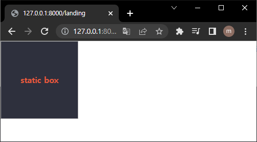</p>

- relative (상대위치)

  - 기본 위치(static으로 지정되었을 때의 위치)를 기준으로 좌표 프로퍼티(top, bottom, left, right)를 사용하여 위치를 이동시킵니다.

  - static을 선언한 요소와 relative를 선언한 요소의 차이점은 좌표 프로퍼티의 동작 여부뿐이며 그외는 동일하게 동작합니다.

  ```html
  <!DOCTYPE html>
  <html>
    <head>
      <style>
        body {
          margin: 0;
        }
        .parent {
          width: 150px;
          height: 150px;
          background: #bcbcbc;
          border: 1px solid #bcbcbc;
          margin: 50px;
        }
        .relative-box {
          position: relative;
          top: 50px;
          left: 50px;
          background: #2e303d;
          color: #e55c3c;
          font-weight: bold;
          text-align: center;
          line-height: 150px;
        }
      </style>
    </head>
    <body>
      <div class="parent">
        <div class="relative-box">relative box</div>
      </div>
    </body>
  </html>
  ```

  <p align="center"></p>

- absolute (절대위치)

  - 부모 요소 또는 가장 가까이 있는 조상 요소(static 제외)를 기준으로 좌표 프로퍼티(top, bottom, left, right)만큼 이동합니다. 즉, relative, absolute, fixed 프로퍼티가 선언되어 있는 부모 또는 조상 요소를 기준으로 위치가 결정됩니다.

  - 만일 부모 또는 조상 요소가 static인 경우, document body를 기준으로 하여 좌표 프로퍼티대로 위치하게 됩니다.

  ```html
  <!DOCTYPE html>
  <html>
    <head>
      <style>
        body {
          margin: 0;
        }
        .parent {
          width: 200px;
          height: 200px;
          background: #bcbcbc;
          border: 1px solid #bcbcbc;
          margin: 50px 0 0 300px;
          position: relative;
        }
        .absolute-box {
          position: absolute;
          height: 200px;
          width: 200px;
          top: 50px;
          left: 50px;
          color: #e55c3c;
          font-weight: bold;
          text-align: center;
          background: #2e303d;
          line-height: 200px;
        }
      </style>
    </head>
    <body>
      <div class="parent">
        <div class="absolute-box">absolute box (in parent)</div>
      </div>
      <div class="absolute-box">absolute box (no parent)</div>
    </body>
  </html>
  ```

  <p align="center"></p>

- fixed (고정위치)

  - 스크롤이 되더라도 화면에서 사라지지 않고 항상 같은 곳에 위치합니다.

  - fixed 프로퍼티 선언 시, block 요소의 width는 inline 요소와 같이 content에 맞게 변화되므로 적절한 width를 지정하여야 합니다.

  ```html
  <!DOCTYPE html>
  <html>
    <head>
      <style>
        body {
          margin: 0;
        }
        .fixed-box {
          position: fixed;
          color: #e55c3c;
          font-weight: bold;
          text-align: center;
          background: #2e303d;
        }
        .sidebar {
          width: 50px;
          height: 100%;
          top: 0;
          right: 0;
          padding-top: 100px;
        }
        .footer {
          width: 200px;
          width: 100%;
          height: 50px;
          bottom: 0;
          left: 0;
          line-height: 50px;
        }
      </style>
    </head>
    <body>
      <div class="fixed-box sidebar">fixed box (side-bar)</div>
      <div class="fixed-box footer">fixed box (footer)</div>
    </body>
  </html>
  ```

  <p align="center">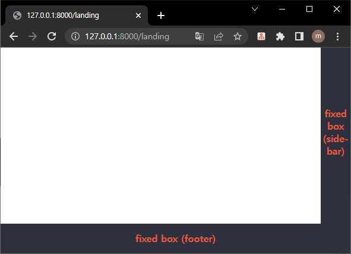</p>

### 2) z-index 프로퍼티

- z-index 프로퍼티에 큰 숫자값을 지정할수록 화면 전면에 출력됩니다.

- positon 프로퍼티가 static 이외인 요소에만 적용된다.

### 3) overflow 프로퍼티

| 프로퍼티값 | Description                                                                                   |
| :--------- | :-------------------------------------------------------------------------------------------- |
| visible    | 영역을 벗어난 부분을 표시한다. (기본값)                                                       |
| hidden     | 영역을 벗어난 부분을 잘라내어 보이지 않게 한다.                                               |
| scroll     | 영역을 벗어난 부분이 없어도 스크롤 표시한다.(현재 대부분 브라우저는 auto과 동일하게 작동한다) |
| auto       | 영역을 벗어난 부분이 있을때만 스크롤 표시한다.                                                |

```html
<!DOCTYPE html>
<html>
  <head>
    <style>
      div {
        width: 150px;
        height: 150px;
        padding: 10px;
        margin: 30px;
        font-size: 1.2em;
        border-radius: 6px;
        border-color: gray;
        border-style: dotted;
        float: left;
      }
      .visible {
        overflow: visible;
      }
      .hidden {
        overflow: hidden;
      }
      .scroll {
        overflow: scroll;
      }
      .auto {
        overflow: auto;
      }
    </style>
  </head>
  <body>
    <h1>overflow</h1>
    <div class="visible">
      <h3>visible</h3>
      Lorem ipsum dolor sit amet, consectetur adipisicing elit, sed do eiusmod
      tempor incididunt ut labore et dolore magna aliqua.
    </div>
    <div class="hidden">
      <h3>hidden</h3>
      Lorem ipsum dolor sit amet, consectetur adipisicing elit, sed do eiusmod
      tempor incididunt ut labore et dolore magna aliqua.
    </div>
    <div class="scroll">
      <h3>scroll</h3>
      Lorem ipsum dolor sit amet, consectetur adipisicing elit, sed do eiusmod
      tempor incididunt ut labore et dolore magna aliqua.
    </div>
    <div class="auto">
      <h3>auto</h3>
      Lorem ipsum dolor sit amet, consectetur adipisicing elit, sed do eiusmod
      tempor incididunt ut labore et dolore magna aliqua.
    </div>
  </body>
</html>
```

<p align="center">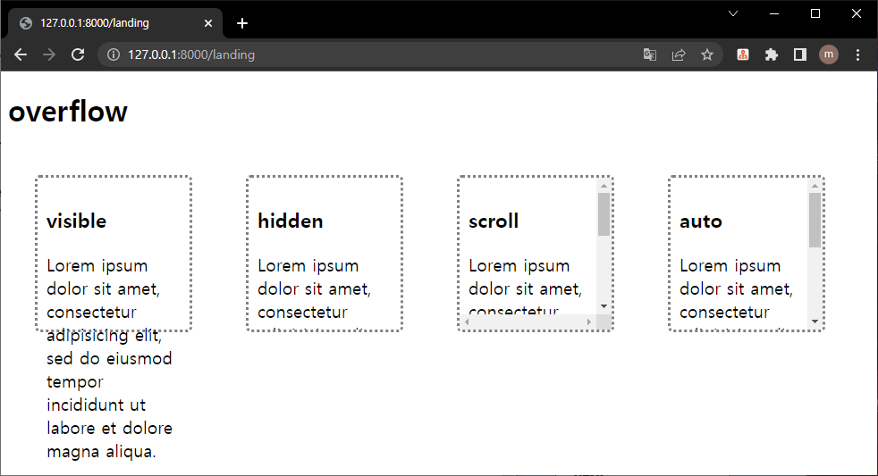</p>

| 프로퍼티값 | Description                          |
| :--------- | :----------------------------------- |
| none       | 요소를 떠 있게 하지 않는다. (기본값) |
| right      | 요소를 오른쪽으로 이동시킨다         |
| left       | 요소를 왼쪽으로 이동시킨다.          |

## 웹디자인 타이포그래피(Typography)

- 웹디자인 관점에서 폰트의 선택은 중요한 의미를 갖습니다.

- 아름답고 정돈된 폰트를 사용한다면 그 자체만으로도 훌륭한 웹디자인이 가능합니다.

- 웹페이지를 구성하는 html, css, javascript 파일이 사용자의 요청에 의해 서버에서 클라이언트로 다운로드되어 실행되는 것과 같이 폰트 또한 서버에서 클라이언트로 다운로드되어 실행될 수 있다면 이 문제는 해결될 수 있습니다.

### 1) CDN(Content Delivery Network) 링크 방식

- Google Font 에서 사용하고자 하는 웹폰트를 선택합니다.

- 한글 웹페이지에 자주 사용되는 나눔고딕은 Google Font Early Access에서 찾을 수 있습니다.

- 아래 구문을 CSS 파일에 추가한다.

```css
@import url(http://fonts.googleapis.com/earlyaccess/nanumgothic.css);

* {
  font-family: "Nanum Gothic", sans-serif;
}
```

### 2) 서버 폰트 로딩 방식

- 여러 개의 폰트를 사용한다면 로딩에 더욱 시간이 걸릴 것 입니다. 또한 CDN 링크를 제공하지 않는 폰트는 사용할 방법이 없습니다. 이러한 단점을 보완한 방법이 서버 폰트 로딩 방식입니다.

```css
@font-face {
  font-family: myFontName;
  src: url("myFont.woff");
}

* {
  font-family: myFontName, sans-serif;
}
```

## 레이아웃

- layout의 핵심은 블록 레벨 요소들을 원하는 위치에 배열하는 것입니다.

### 1) Header & Navigation Bar

- 대부분의 웹사이트는 Navigation Bar를 가지고 있습니다.

- Navigation Bar는 웹사이트의 필수 구성 요소라고 할 수 있을 것이다.

- Navigation Bar는 기본적으로 링크들의 리스트입니다. 따라서 ul, li tag를 이용하여 작성하는 것이 일반적입니다.

### 2) Section & Aside

- 콘텐츠의 영역을 Section, 콘텐츠에 대한 Navigation item이나 부가 정보 영역을 Aside라 합니다.

- Section 영역은 다시 article 영역으로 구분할 수 있습니다.

### 3) footer

- content-wrap 영역 다음에 footer를 배치합니다.

### 전체 코드

```html
<!DOCTYPE html>
<html>
  <head>
    <meta charset="UTF-8" />
    <meta http-equiv="X-UA-Compatible" content="ie=edge" />
    <style>
      /* Simple Reset CSS */
      * {
        margin: 0;
        padding: 0;
        box-sizing: border-box;
      }
      body {
        font-family: "Helvetica Neue", Helvetica, Arial, sans-serif;
        color: #58666e;
        background-color: #f0f3f4;
        -webkit-font-smoothing: antialiased;
        -webkit-text-size-adjus: 100%; /* iphone font size 변경 방지 */
      }
      li {
        list-style: none;
      }
      a {
        text-decoration: none;
      }
      h1,
      h2,
      h3,
      h4,
      h5,
      h6,
      p {
        margin: 10px 5px;
      }
      h1 {
        font-size: 1.8em;
      }

      #wrap {
        width: 100%;
        /* margin-top = header height */
        margin-top: 60px;
      }

      /* Navigation bar */
      header {
        /* for sticky header */
        position: fixed;
        top: 0;

        width: 100%;
        height: 60px;
        z-index: 2000;
        background-color: #fff;
        box-shadow: 0 2px 2px rgba(0, 0, 0, 0.05), 0 1px 0 rgba(0, 0, 0, 0.05);
      }
      .logo {
        display: inline-block;
        height: 36px;
        margin: 12px 0 12px 25px;
      }
      .logo > img {
        height: 36px;
      }
      nav {
        float: right;
      }
      .nav-items {
        margin-right: 20px;
      }
      .nav-items > li {
        display: inline-block; /* 가로정렬 */
      }
      .nav-items > li > a {
        /* for Vertical Centering */
        line-height: 60px;
        padding: 0 30px;
        color: rgba(0, 0, 0, 0.4);
      }
      .nav-items > li > a:hover {
        color: rgba(0, 0, 0, 0.8);
      }

      /* contents */
      /* clearfix */
      #content-wrap:after {
        content: "";
        display: block;
        clear: both;
      }
      aside {
        /* for fixed side bar */
        position: fixed;
        top: 60px;
        bottom: 0;
        width: 200px; /* 너비 고정 */
        padding-top: 25px;
        background-color: #333;
      }
      /* aside navigation */
      aside > ul {
        width: 200px;
      }
      aside > ul > li > a {
        display: block;
        color: #fff;
        padding: 10px 0 10px 20px;
      }
      aside > ul > li > a.active {
        background-color: #4caf50;
      }
      aside > ul > li > a:hover:not(.active) {
        background-color: #555;
      }
      aside > h1 {
        padding: 20px 0 20px 20px;
        color: #fff;
      }
      /* Section */
      section {
        float: right;
        /* aside width */
        margin-left: 200px;
      }
      article {
        margin: 10px;
        padding: 25px;
        background-color: white;
      }
      /* footer */
      footer {
        /* footer를 aside위에 올리기 위해 사용(부유객체) */
        position: absolute;
        height: 60px;
        width: 100%;
        padding: 0 25px;
        line-height: 60px;
        color: #8a8c8f;
        border-top: 1px solid #dee5e7;
        background-color: #f2f2f2;
      }
    </style>
  </head>
  <body>
    <div id="wrap">
      <header>
        <a class="logo" href="#home"
          ></a>
        <nav>
          <ul class="nav-items">
            <li><a href="#home">Home</a></li>
            <li><a href="#news">News</a></li>
            <li><a href="#contact">Contact</a></li>
            <li><a href="#about">About</a></li>
          </ul>
        </nav>
      </header>

      <div id="content-wrap">
        <aside>
          <h1>Aside</h1>
          <ul>
            <li><a href="#" class="active">London</a></li>
            <li><a href="#">Paris</a></li>
            <li><a href="#">Tokyo</a></li>
            <li><a href="#">Newyork</a></li>
          </ul>
        </aside>
        <section>
          <article id="london">
            <h1>London</h1>
            <p>
              London is the capital city of England. It is the most populous
              city in the United Kingdom, with a metropolitan area of over 13
              million inhabitants.
            </p>
            <p>
              Standing on the River Thames, London has been a major settlement
              for two millennia,its history going back to its founding by the
              Romans, who named it Londinium.
            </p>
            <p>
              London, also referred to as Greater London, is one of 9 regions of
              England and the top-level subdivision covering most of the city's
              metropolis. The small ancient City of London at its core once
              comprised the whole settlement, but as its urban area grew, the
              Corporation of London resisted attempts to amalgamate the city
              with its suburbs, causing "London" to be defined in a number ways
              for different purposes.
            </p>
          </article>
          <article id="paris">
            <h1>Paris</h1>
            <p>
              London is the capital city of England. It is the most populous
              city in the United Kingdom, with a metropolitan area of over 13
              million inhabitants.
            </p>
            <p>
              Standing on the River Thames, London has been a major settlement
              for two millennia,its history going back to its founding by the
              Romans, who named it Londinium.
            </p>
            <p>
              London, also referred to as Greater London, is one of 9 regions of
              England and the top-level subdivision covering most of the city's
              metropolis. The small ancient City of London at its core once
              comprised the whole settlement, but as its urban area grew, the
              Corporation of London resisted attempts to amalgamate the city
              with its suburbs, causing "London" to be defined in a number ways
              for different purposes.
            </p>
          </article>
          <article id="tokyo">
            <h1>Tokyo</h1>
            <p>
              London is the capital city of England. It is the most populous
              city in the United Kingdom, with a metropolitan area of over 13
              million inhabitants.
            </p>
            <p>
              Standing on the River Thames, London has been a major settlement
              for two millennia,its history going back to its founding by the
              Romans, who named it Londinium.
            </p>
            <p>
              London, also referred to as Greater London, is one of 9 regions of
              England and the top-level subdivision covering most of the city's
              metropolis. The small ancient City of London at its core once
              comprised the whole settlement, but as its urban area grew, the
              Corporation of London resisted attempts to amalgamate the city
              with its suburbs, causing "London" to be defined in a number ways
              for different purposes.
            </p>
          </article>
          <article id="newyork">
            <h1>Newyork</h1>
            <p>
              London is the capital city of England. It is the most populous
              city in the United Kingdom, with a metropolitan area of over 13
              million inhabitants.
            </p>
            <p>
              Standing on the River Thames, London has been a major settlement
              for two millennia,its history going back to its founding by the
              Romans, who named it Londinium.
            </p>
            <p>
              London, also referred to as Greater London, is one of 9 regions of
              England and the top-level subdivision covering most of the city's
              metropolis. The small ancient City of London at its core once
              comprised the whole settlement, but as its urban area grew, the
              Corporation of London resisted attempts to amalgamate the city
              with its suburbs, causing "London" to be defined in a number ways
              for different purposes.
            </p>
          </article>
        </section>
        <!-- end of content-wrap -->
      </div>
      <footer>© Copyright 2016 ungmo2</footer>
      <!-- end of wrap   -->
    </div>
  </body>
</html>
```

<p align="center"></p>

## 플렉스 박스 레이아웃

### 1) Introduction

- Flexbox는 모던 웹을 위하여 제안된 기존 layout보다 더 세련된 방식의 니즈에 부합하기 위한 CSS3의 새로운 layout 방식입니다.

- 요소의 사이즈가 불명확하거나 동적으로 변화할 때에도 유연한 레이아웃을 실현할 수 있습니다. 복잡한 레이아웃이라도 적은 코드로 보다 간단하게 표현할 수 있습니다.

- 이해를 돕기 위해 간단한 flexbox 레이아웃을 만들어 보겠습니다.

```html
<!DOCTYPE html>
<html>
  <head>
    <meta charset="UTF-8" />
    <title>Flexbox Layout Example</title>
    <style>
      .flex-container {
        margin: 10px;
        padding: 15px;
        border-radius: 5px;
        background: #60b99a;
      }

      .flex-item {
        margin: 10px;
        padding: 20px;
        color: #fff;
        text-align: center;
        border-radius: 5px;
        background: #4584b1;
      }
    </style>
  </head>
  <body>
    <div class="flex-container">
      <div class="flex-item">1</div>
      <div class="flex-item">2</div>
      <div class="flex-item">3</div>
      <div class="flex-item">4</div>
      <div class="flex-item">5</div>
    </div>
  </body>
</html>
```

<p align="center"></p>

```css
.flex-container {
  margin: 10px;
  padding: 15px;
  border-radius: 5px;
  background: #60b99a;

  display: flex;
  justify-content: space-around;
}

.flex-item {
  margin: 10px;
  padding: 20px;
  color: #fff;
  text-align: center;
  border-radius: 5px;
  background: #4584b1;
}
```

<p align="center"></p>

- Flexbox의 장점을 정리해 보면 아래와 같습니다.

  - 1줄의 코드 추가로 수평 정렬이 가능합니다.

  - 요소의 상하좌우 정렬, 순서 변경이 간단합니다.

  - 요소가 간격 조절이 간단합니다.

  - 서로 다른 height를 갖는 요소의 수평정렬 시, 간단히 상하중앙 정렬이 가능합니다.

### 2) Usage

- Flexbox 레이아웃은 flex item이라 불리는 복수의 자식 요소와 이들을 내포하는 flex-container 부모 요소로 구성됩니다.

<p align="center"></p>

### 3) Flexbox container 속성

- flex-direction

  - flex-direction 속성은 flex 컨테이너의 주축(main axis) 방향을 설정한다.

  ```css
  flex-direction: row;
  flex-direction: row-reverse;
  flex-direction: column;
  flex-direction: column-reverse;
  ```

  <p align="center"></p>

  <p align="center"></p>

  <p align="center"></p>

  <p align="center"></p>

- flex-wrap

  - flex-wrap 속성은 flex 컨테이너의 복수 flex item을 1행으로 또는 복수행으로 배치합니다.

  ```css
  flex-wrap: nowrap;
  flex-wrap: wrap;
  flex-wrap: wrap-reverse;
  ```

  <p align="center"></p>

  <p align="center"></p>

  <p align="center"></p>

- flex-flow

  - flex-flow 속성은 flex-direction 속성과 flex-wrap 속성을 설정하기 위한 shorthand입니다.

  ```css
  flex-flow: <flex-direction> || <flex-wrap>;
  ```

- justify-content

  - flex container의 main axis를 기준으로 flex item을 수평 정렬합니다.

  ```css
  justify-content: flex-start;
  justify-content: flex-end;
  justify-content: center;
  justify-content: space-between;
  justify-content: space-around;
  ```

  <p align="center"></p>

  <p align="center"></p>

  <p align="center"></p>

  <p align="center"></p>

  <p align="center"></p>

- align-items

  - flex item을 flex container의 수직 방향(cross axis)으로 정렬합니다. align-items 속성은 모든 flex item에 적용됩니다.

  ```css
  align-items: stretch;
  align-items: flex-start;
  align-items: flex-end;
  align-items: center;
  align-items: baseline;
  ```

  <p align="center"></p>

  <p align="center"></p>

  <p align="center"></p>

  <p align="center"></p>

  <p align="center"></p>

- align-content

  - flex container의 cross axis를 기준으로 flex item을 수직 정렬합니다.

  ```css
  align-content: stretch;
  align-content: flex-start;
  align-content: flex-end;
  align-content: center;
  align-content: space-between;
  align-content: space-around;
  ```

  <p align="center"></p>

  <p align="center"></p>

  <p align="center"></p>

  <p align="center"></p>

  <p align="center"></p>

  <p align="center"></p>

### 4) Flexbox item 속성

- order

  - flex item의 배치 순서를 지정합니다.

  ```css
  .flex-item {
    order: 정수값;
  }
  ```

  <p align="center"></p>

- flex-grow

  - flex item의 너비에 대한 확대 인자(flex grow factor)를 지정합니다.

  ```css
  .flex-item {
    flex-grow: 양의 정수값;
  }
  ```

  <p align="center"></p>

- flex-shrink

  - flex item의 너비에 대한 축소 인자(flex shrink factor)를 지정합니다.

  ```css
  .flex-item {
    flex-shrink: 양의 정수값;
  }
  ```

  <p align="center"></p>

- flex-basis

  - flex item의 너비 기본값을 px, % 등의 단위로 지정합니다.

  ```css
  .flex-item {
    flex-basis: auto | <width>;
  }
  ```

  <p align="center"></p>

- flex

  - flex-grow, flex-shrink, flex-basis 속성의 shorthand이다.

  ```css
  .flex-item {
    flex: none | auto | [ <flex-grow> <flex-shrink>? || <flex-basis> ];
  }
  ```

- align-self

  - align-items 속성(flex container속성으로 flex item을 flex container의 수직 방향(cross axis)으로 정렬한다.)보다 우선하여 개별 flex item을 정렬합니다.

  ```css
  .flex-item {
    align-self: auto | flex-start | flex-end | center | baseline | stretch;
  }
  ```

  <p align="center"></p>
