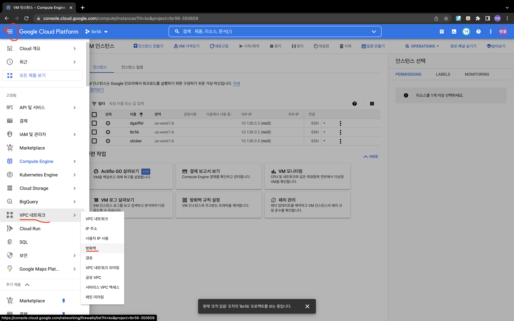
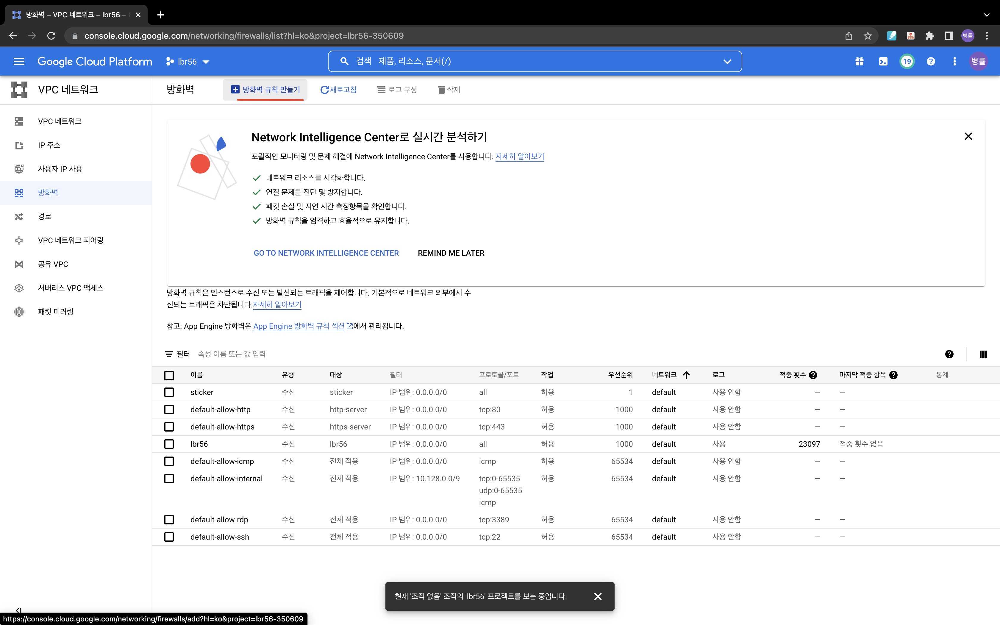
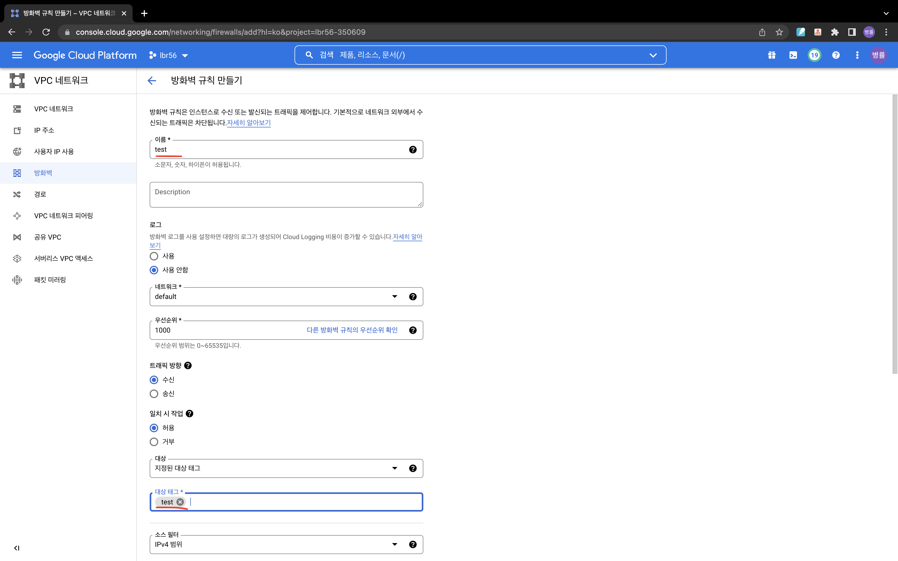
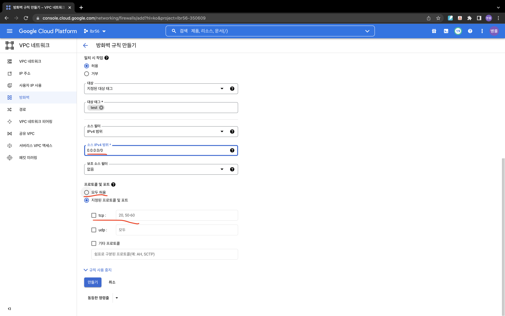
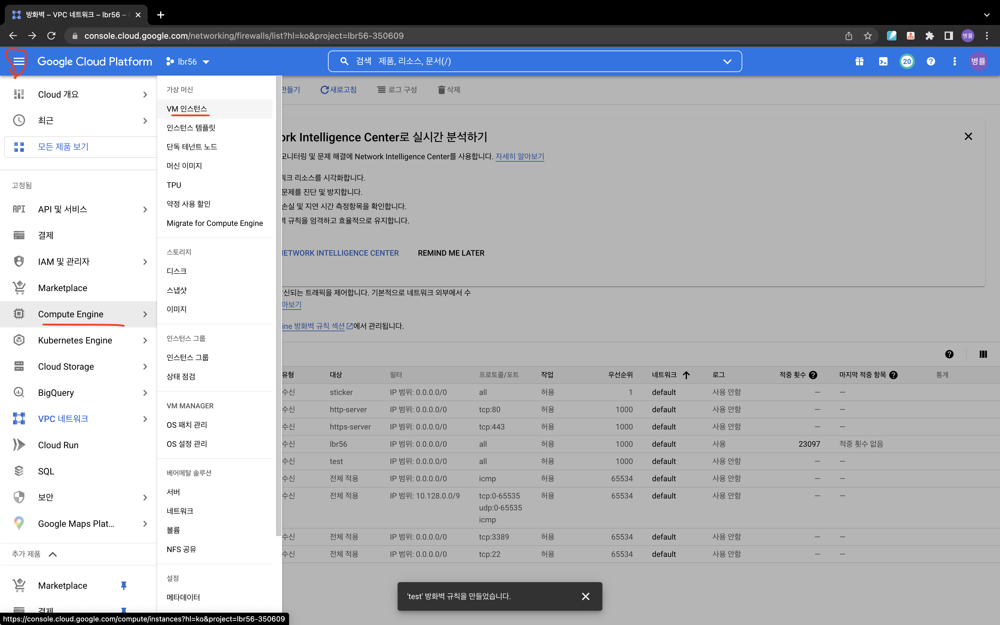
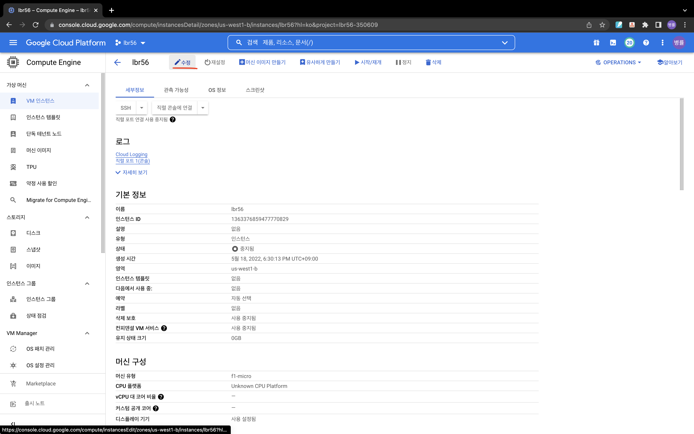
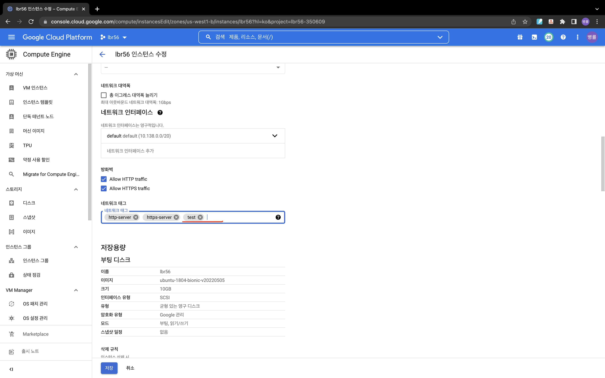

# 6-2. FireWall

- 외부에서 프로젝트에 접근하기 위하여 GCP에 설정되어 있는 방화벽을 완화할 필요가 있습니다.

## 목차

***

- [방화벽 규칙 만들기](#방화벽-규칙-만들기)
- [VM에 방화벽 설정하기](#vm에-방화벽-설정하기)

## 방화벽 규칙 만들기

***

- 방화벽 규칙 생성은 다음 위치를 따라 가면 보실 수 있습니다.

- 메뉴 > VPC 네트워크 > 방화벽 순으로 이동하여 줍니다.

- 방화벽 규칙 만들기를 클릭합니다.

- 가장 먼저 이름을 설정해줍니다.
- 이름은 아래 규칙에 따라 작성해주시면 됩니다. 저는 test로 이름을 지정하였습니다.
- 대상 태그 부분은 이름과 동일하게 작성할 필요는 없지만, 쉽게 알아 차릴 수 있도록 동일 이름으로 설정하였습니다.

### IPv4 범위 지정

- 소스 IPv4 범위는 어떤 IP의 통신을 받아 들일지 결정하는 것입니다.
- 0.0.0.0/0 이란, 전체 컴퓨터 통신을 허용한다는 뜻입니다.
- 보안적으로 문제가 발생할 수 있음으로 지양하지만, 공부를 위해 다음과 같이 설정하였습니다.

### 프로토콜 및 포트

- 프로토콜 및 포트는 어떤 방법으로 통신을 할 것인지, 다음 통신에 어떤 프로세스와 통신할지 정하는 것입니다.
- 경우에 따라, 'tcp 프로토콜을 통해 8000 포트로 통신을 한다!'라고 설정해 줄 수 있습니다.
- 하지만 위와 같은 이유로 모두 허용을 하겠습니다.

## VM에 방화벽 설정하기

***

- 이제 VM 인스턴스에 방화벽 설정을 연결해주도록 하겠습니다.
- 메뉴 > Compute Engine > VM 인스턴스 순으로 이동하여 줍니다.

- 모델을 접근하여 수정버튼을 눌러줍니다.

- 네트워크 태그에 방금 지정한 태그를 입력하여 줍니다.
