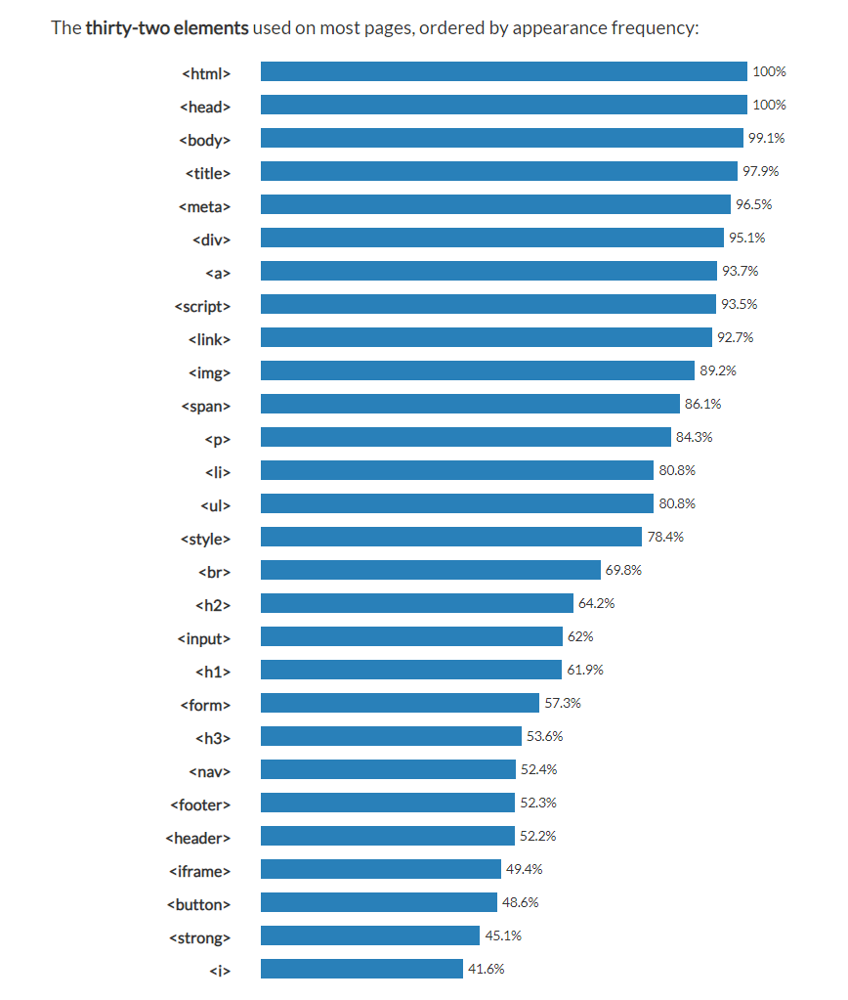
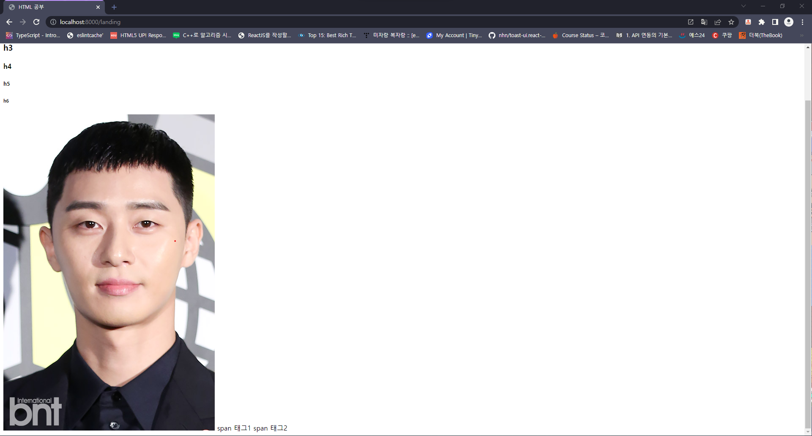
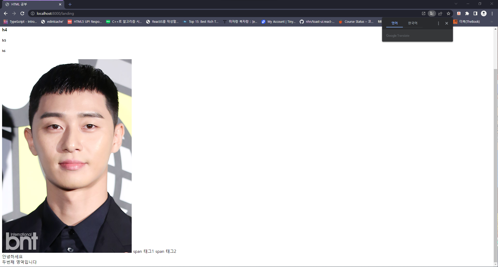
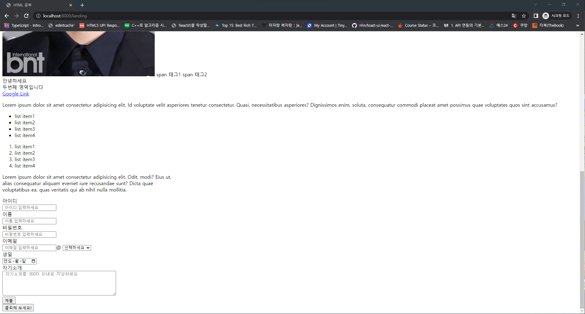
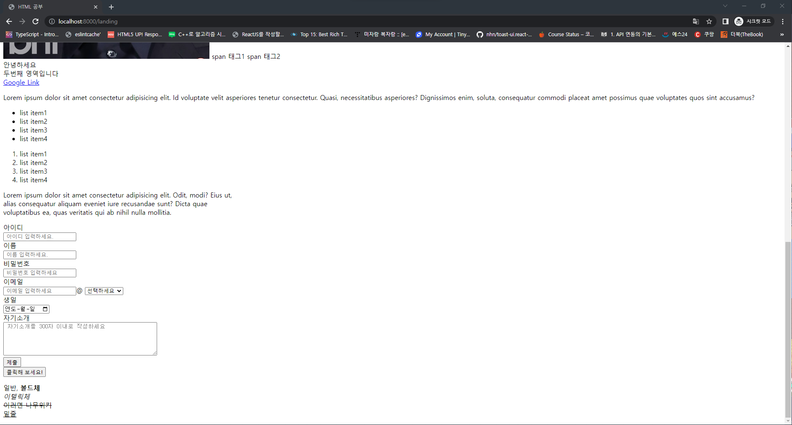

# 2-2. HTML

## Hello Friend

- 먼저 `http://localhost:8000/`에 접속했을때 Hello Friend가 나타나는 웹사이트를 만들어 보도록 하죠

- 그럼 `project` 폴더에 `templates`,`static`라는 폴더를 만들고 `templates` 안에 `Landing`을 `static` 안에는 `css`,`images` 폴더를 만들어 보도록 합시다

```console
프로젝트이름(폴더)
├─manage.py
├─Landing(폴더)
|   ├─__init__.py
│   ├─admin.py
│   ├─apps.py
│   ├─models.py
│   ├─tests.py
│   ├─views.py
│   └─migrations
├─templates(폴더)
│  └─landing(폴더)
├─static(폴더)
│  ├─css(폴더)
│  └─images(폴더)
└─config(폴더)
   ├─__init__.py
   ├─asgi.py
   ├─urls.py
   ├─wsgi.py
   └─settings
      └─settings.py
```

- `static` 은 정적파일을 보관하는 폴더로 `이미지`, `css(웹페이지를 꾸며주는 파일)`, `javascript` 같은 파일들이 들어가게 됩니다.

- `templates`는 `HTML`파일을 보관하는 폴더로 `App`들의 HTML 파일들이 보관되는 용도로 사용됩니다.

- 이제 `templates/landing`안에 `index.html`파일을 만들고 아래 내용을 넣어주시길 바랍니다.

```html
<!DOCTYPE html>
<html lang="en">
  <head>
    <meta charset="UTF-8" />
    <meta http-equiv="X-UA-Compatible" content="IE=edge" />
    <meta name="viewport" content="width=device-width, initial-scale=1.0" />
    <title>Document</title>
  </head>
  <body>
    <h1>Hello Friends</h1>
  </body>
</html>
```

- 해당 파일을 모두 복사해서 내용을 넣어 보셨나요?

- 만약 여러분이 `vscode`를 사용하고 계시다면 `!`를 타이핑 함으로 자동완성을 할수 있을겁니다. (한번 해보시겠나요?)

```html
<!DOCTYPE html>
<html lang="en">
  <head>
    <meta charset="UTF-8" />
    <meta http-equiv="X-UA-Compatible" content="IE=edge" />
    <meta name="viewport" content="width=device-width, initial-scale=1.0" />
    <title>Document</title>
  </head>
  <body></body>
</html>
```

- 그럼 이렇게 코드가 완성되고 우리는 `<body> </body>`안에 `<h1> Hello Friends</h1>`을 넣어 주면 됩니다.

- 자 그럼 다시 돌아와서 우리는 `index.html`이라는 파일을 윈도우에서 폴더를 찾아 들어가 한번 실행 시켜 보도록 합시다.

<p align="center"></p>

- html 파일에서 작성했던 Hello Friends가 있는것을 볼수 있습니다.

- 우리는 이제 `Django`라는 서버를 통해 내 컴퓨터에 있는 `index.html`파일을 올려 보도록 하겠습니다.

- 올리기 위해선 몇가지 사전에 해야하는 작업들이 몇가지 있습니다.

  - 1. `templates`폴더의 위치를 `project`에서 알수 있기 해주어야 합니다.

  - 2. `App`에서 `html`파일을 중계 해주어야 합니다.

  - 3. `urls.py`에서 어떤 사이트의 주소(url) 검색해야 `App`에서 중계 해주는 `html`을 찾을수 있습니다.

- 그럼 우선 `templates` 폴더 위치를 `project`의 설정 파일인 `setting.py`에서 설정을 해주도록 하겠습니다.

- `setting.py` 파일 안에는 `BASE_DIR`이라는 경로를 설정하는 파일이 있습니다.

- 해당 경로는 현재는 우리가 파일의 위치를 `config` 폴더에서 `settings`폴더로 옮겼기 때문에 문제가 생기게 됩니다.

- 이러한 부분은 아래와 같이 코드를 수정하면 해결할수 있습니다.

```py
# settings.py 의 15번째 줄

#Before
BASE_DIR = Path(__file__).resolve().parent.parent # 현재 폴더의 부모의 부모 == Config 폴더

#After
BASE_DIR = Path(__file__).resolve().parent.parent.parent # 현재 폴더의 부모의 부모의 부모 == Project폴더

```

- 다음으로 `templates` 와 `static`를 수정하시면 되는데 아래와 같이 `settings.py`를 수정하면 됩니다.

```py
#templates 설정
#settings.py의 54번째 줄

#Before
TEMPLATES = [
    {
        'BACKEND': 'django.template.backends.django.DjangoTemplates',
        'DIRS': [],
        'APP_DIRS': True,
        'OPTIONS': {
            'context_processors': [
                'django.template.context_processors.debug',
                'django.template.context_processors.request',
                'django.contrib.auth.context_processors.auth',
                'django.contrib.messages.context_processors.messages',
            ],
        },
    },
]

#After
TEMPLATES = [
    {
        'BACKEND': 'django.template.backends.django.DjangoTemplates',
        'DIRS': [BASE_DIR/'templates'],
        'APP_DIRS': True,
        'OPTIONS': {
            'context_processors': [
                'django.template.context_processors.debug',
                'django.template.context_processors.request',
                'django.contrib.auth.context_processors.auth',
                'django.contrib.messages.context_processors.messages',
            ],
        },
    },
]
```

```py
#static 설정
# settings.py 119번째 줄 근처

#Before
STATIC_URL = 'static/'

#After
STATIC_URL = 'static/'
STATICFILES_DIRS = [BASE_DIR/'static']

```

- 이와 같이하면 `static`과 `templates`가 연결이 됩니다.

- 그다음은 `Landing`폴더에 있는 `views.py`를 아래와 같이 바꾸어 `index.html`을 가리키는 함수 `index`를 만들어 주겠습니다.

```py
from django.shortcuts import render

# Create your views here.
def index(req):
    return render(req,'Landing/index.html')
```

- 이렇게 하면 `Landing` 에서 야 내가 보여주고 싶은 `HTML`파일은 여기에 있어! 라고 말을 할수 있게 되었습니다.

- 하지만 `project`에서는 아직 `Landing`에서 말하는 `HTML`을 어디 `URL`에서 보여줄건지 알수 없기 때문에 project에 `urls.py`에서 작업을 하도록 하겠습니다.

```py
from django.contrib import admin
from django.urls import include,path
import Landing.views # Landing의 views의 파일 불러오기

urlpatterns = [
    path('admin/', admin.site.urls),
    path('landing',Landing.views.index,name="index") # http://localhost:8000/landing 진입시 페이지 보여주기
]

```

- 이렇게 작성을 하고 `http://127.0.0.1:8000/landing` 또는 `http://localhost:8000/landing` 을 크롬 `URL`에 입력하게 되면 결과물이 나오는 것을 볼수 있습니다.

<p align="center"></p>

## HTML 구조 및 개념

- `HTML`의 구조는 `index.html`에서 잠깐 볼수 있는데 아래 주석을 달아 놓도록 하겠습니다.

```html
<!DOCTYPE html>
<!-- DocumentType의 줄임말로 해당 파일이 HTML이라는것을 알려주는 태그 "이 문서는 HTML이야" -->
<html lang="en">
  <!-- html의 시작을 알리는 태그 "이제부터 HTML 시작!" -->
  <head>
    <!--  html의 설정 들을 담든 태그 "우리는 실제 웹페이지에서는 보이지 않아!" -->
    <meta charset="UTF-8" />
    <meta http-equiv="X-UA-Compatible" content="IE=edge" />
    <meta name="viewport" content="width=device-width, initial-scale=1.0" />
    <title>Document</title>
    <!-- 크롬 Tab에 들어가는 문구를 정하는 태그 -->
  </head>
  <body></body>
  <!-- 웹페이지에 들어가는 내용을 담는 태그! "여기에 내용을 적으면 웹페이지의 내용물이야!" -->
</html>
<!-- html의 끝을 알리는 태그 "HTML 끝!" -->
```

- 위에서 `index.html`에 대한 설명을 적었는데 알아 보도록 하겠습니다.

- `HTML`의 내용물을 보면 아시겠지만 `<내용> </내용>` 이나 `<내용/>`과 같은 모양을 가지고 있습니다.

- 이러한 모양들을 우리는 `tag(태그)`라고 부르는데, 태그에 `/`이 들어가지 않은 태그를 `<내용>` `열림 태그` 아닌 태그들을 `</내용>` `닫힌 태그`라고 이야기합니다.

- 닫힌 태그 없이 혼자서 `<내용/>`모양을 가지는 태그는 `빈태그(Empty Tag)`라고 말합니다.

> `<html lang="en">` 은 열림 태그 `</html>`은 닫힌 태그 입니다

- 지금 `html`,`meta` 태그안에 `lang`이나 `charset` 과 같은 내용이 들어가 있는데 이러한 내용물들을 `속성(attribute)`라고 이야기합니다.

<p align="center"></p>

- 태그 : 정보 중요도를 나타냅니다. 해당 데이터가 제목인지, 본문 단락인지, 이미지인지, 본문을 설명하는 부분인지 등을 구분합니다.

- 속성 : `태그` 내부에서 보조하는 명령어입니다.

## HTML TAG

- 오래 기다리셨습니다. 이제 지루한 개념은 멀리 치워버리고 실습으로 배워 보도록 하죠!

- `<body> </body>` 태그안에 내용물을 넣어서 페이지를 만들어 보고 `tag`를 넣어 실습을 진행할 것입니다.

- 하지만 태그는 너무나도 많고 사용되지 않는 태그들도 여러개 있기 때문에 `Tag` 랭킹에서 가장 많이 사용되는 태그를 중점으로 이야기하겠습니다. <a href="https://www.advancedwebranking.com/seo/html-study/">Link</a>

<p align="center"></p>

### 1) h1,h2,h3,h4,h5,h6

- `Heading` 문서의 제목을 설정, 문서의 목처 역할

```html
<h1>h1</h1>
<h2>h2</h2>
<h3>h3</h3>
<h4>h4</h4>
<h5>h5</h5>
<h6>h6</h6>
```

<p align="center"></p>

### 2) img

- `Image` 이미지 삽입을 위한 태그
<p align="center"></p>

### 3) span

- `span` 본질적으로 아무것도 나타내지 않는 콘텐츠 영역을 설정.

```html
<span>span 태그1</span> <span>span 태그2</span>
```

<p align="center"></p>

### 4) div

- `Division` 영역을 나타내는 태그
- `span`태그와는 다르게 영역이 `가로영역 전체`를 사용하게 된다는 점입니다.

```html
<div>안녕하세요</div>
<div>두번째 영역입니다</div>
```

<p align="center"></p>

### 5) a

- `anchor` 다른 페이지나 파일, 이메일 주소, 전화 번호등 URL로 연결할 수 있는 하이퍼 링크 설정

- `target` 속성은 링크를 클릭 할때 창을 어떻게 열지 설정

  - 속성은 링크를 클릭 할때 창을 어떻게 열지 설정

  - \_self : 링크를 클릭한 해당 창에서 연다.

  - \_blank : 링크를 새창으로 연다.

  - \_parent : 부모 창에서 연다. (부모 창이 없으면 \_self 속성으로 처리)

  - \_top : 전체 브라우저 창에서 가장 상위의 창에서 연다. (부모 창이 없으면 \_self 속성으로 처리)

```html
<a href="www.google.com" target="_blank">Google Link</a>
```

<p align="center"></p>

### 6) p

- `Paragraph` 하나의 문단을 설정

- `html`파일 안에서 `lorem`이라는 문자를 치면 자동완성으로 의미없는 문장이 완성이 됩니다.

```html
<p>
  Lorem ipsum dolor sit amet consectetur adipisicing elit. Odit, modi? Eius ut,
  alias consequatur aliquam eveniet iure recusandae sunt? Dicta quae
  voluptatibus ea, quas veritatis qui ab nihil nulla mollitia.
</p>
```

<p align="center"></p>

### 7) ul

- `Unordered List` 나열하는 태그
- 해당 태그는 `li` 태그를 자식 태그로 가야 합니다.

### 8) ol

- `ordered List` 숫자 형태로 나열하는 태그
- 해당 태그는 `li` 태그를 자식 태그로 가야 합니다.

### 9) li

- `List Item` 하나의 문단을 설정

```html
<ul>
  <li>list item1</li>
  <li>list item2</li>
  <li>list item3</li>
  <li>list item4</li>
</ul>

<ol>
  <li>list item1</li>
  <li>list item2</li>
  <li>list item3</li>
  <li>list item4</li>
</ol>
```

<p align="center"></p>

### 10) br

- `break` 줄바꿈을 설정

```html
<p>
  Lorem ipsum dolor sit amet consectetur adipisicing elit. Odit, modi? Eius ut,
  <br />
  alias consequatur aliquam eveniet iure recusandae sunt? Dicta quae
  <br />
  voluptatibus ea, quas veritatis qui ab nihil nulla mollitia.
</p>
```

<p align="center"></p>

### 11) form

- 웹 서버에 정보를 제출하기 위한 양식 범위를 정의

- `form`태그는 `자식 태그`에서 정보를 받고 넘기는 역할을 많이 하기 때문에 input 태그에서 예시를 보이도록 하겠습니다.

### 12) input

- 사용자에게 입력 받을 데이터 양식

- input 태그에는 다양한 속성이 있는데 `type`, `value`, `name`, 기타 등등 존재합니다.

  - type: input 태그의 유형입니다.

  - value : 입력 태그의 초기값을 의미합니다.

  - name : 서버로 전달 되는 이름을 말합니다

- 회원 가입 양식을 만들었습니다. 해당 코드를 보고 추가적인 사항은 검색을 해보고 공부하는걸 추천드립니다!

```html
<form>
  <label class="label">아이디</label> <br />
  <input type="text" name="id" placeholder=" 아이디 입력하세요." /> <br />

  <label class="label">이름</label><br />
  <input type="text" name="name" placeholder=" 이름 입력하세요." /> <br />

  <label class="label">비밀번호</label> <br />
  <input
    type="password"
    name="password"
    placeholder=" 비밀번호 입력하세요"
  /><br />

  <label class="label">이메일</label> <br />
  <input type="text" name="email1" placeholder=" 이메일 입력하세요" />@
  <select name="email2">
    <option value="" disabled selected="selected">선택하세요</option>
    <option value="daum.net">daum.net</option>
    <option value="naver.com">naver.com</option>
    <option value="google.com">google.com</option>
    <option value="D">직접 입력</option></select
  ><br />

  <label class="label">생일</label><br />
  <input type="date" name="birth" /><br />

  <label class="label">자기소개</label><br />
  <textarea
    name="profile"
    cols="50"
    rows="5"
    placeholder=" 자기소개를 300자 이내로 작성하세요"
  ></textarea
  ><br />

  <input type="submit" />
</form>
```

<p align="center"></p>

### 13) button

- `button` 버튼 기능을 담당하는 태그

```html
<button type="button" onclick="alert('Hello World!')">클릭해 보세요!</button>
```

<p align="center"></p>

### 14) 글시체

- 글씨체의 `bold`를 담당

```html
<p>
  일반, <br />
  <strong>볼드체</strong> <br />
  <em>이텔릭체</em> <br />
  <del>이러면 나무위키</del> <br />
  <ins>밑줄</ins> <br />
</p>
```

<p align="center"></p>

### 15) nav

- `Semantic Tags`의 일종으로 `navigation`영역을 담당

### 16) footer

- `Semantic Tags`의 일종으로 `footer`영역을 담당

### 17) header

- `Semantic Tags`의 일종으로 `header`영역을 담당
