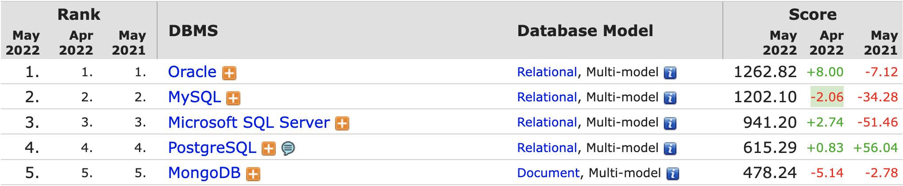
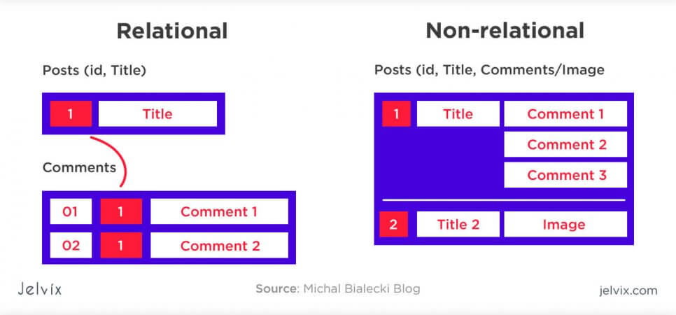
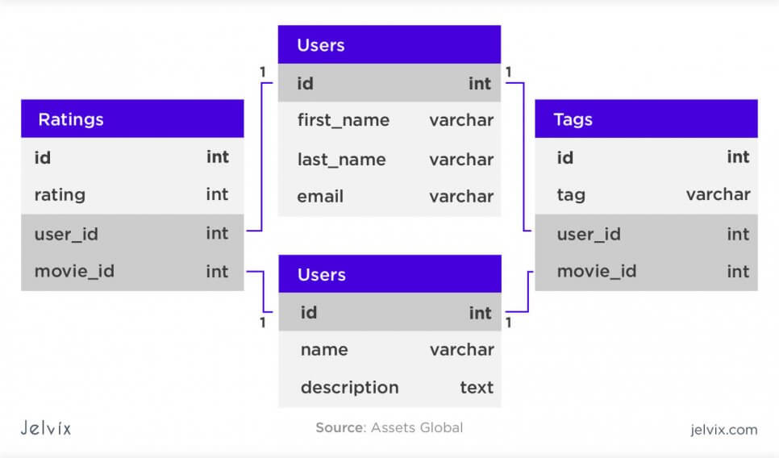
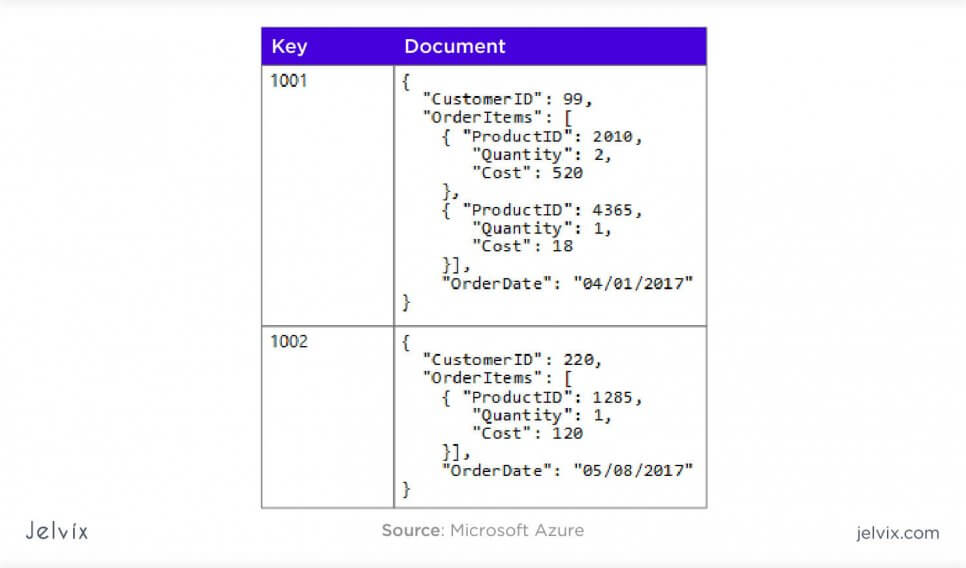
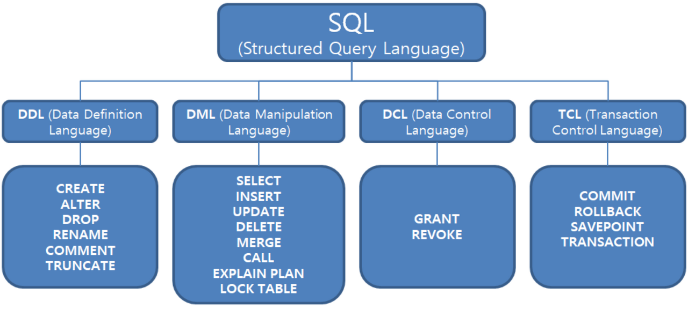
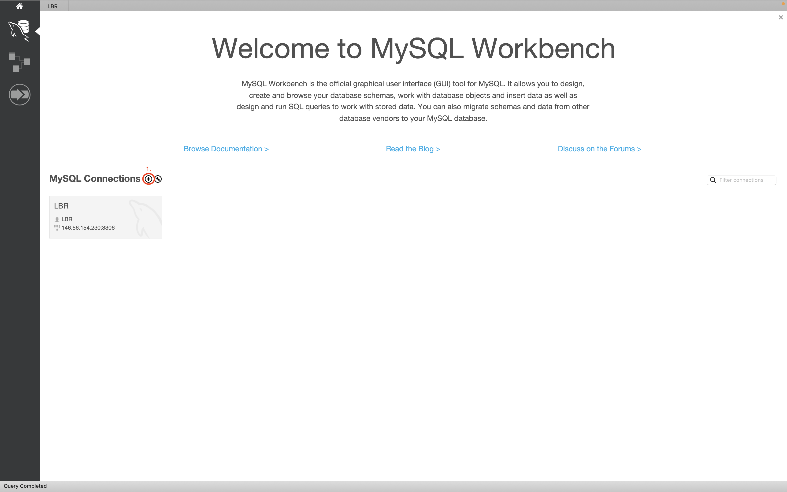
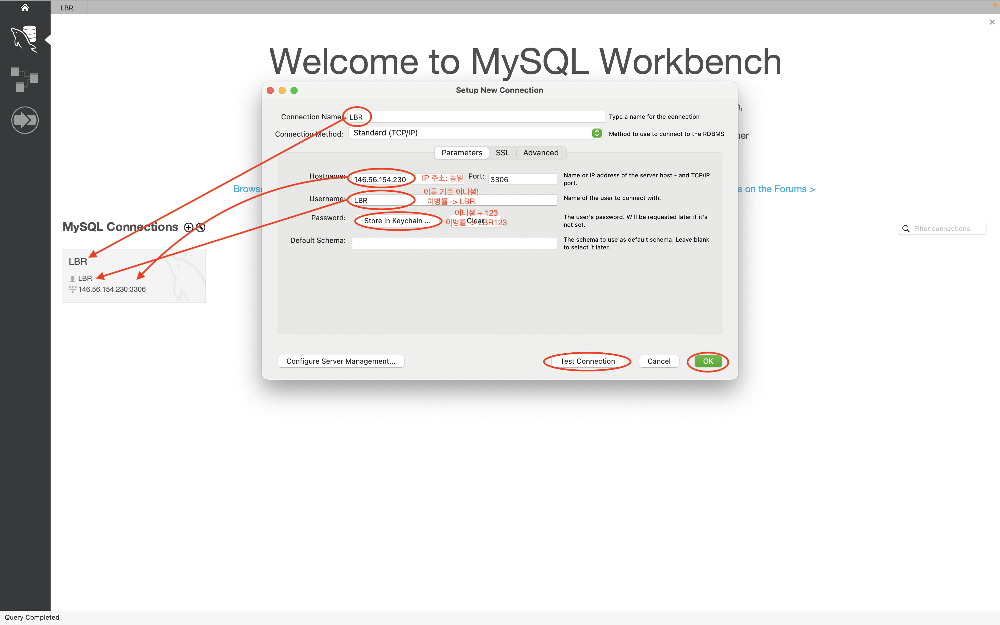

# 5. MySQL

- 데이터베이스는 여러 응용 시스템이 공유할 수 있는 저장된 운영 데이터의 집합이라고 할 수 있습니다.

- 대표적으로 잘 알려진 MySQL를 설명 드리겠습니다!

## 목차

- MySQL이란?

  - 명령어 목록

- [MySQL Workbanch 설치 및 연결하기](#mysql-workbanch-설치-및-연결하기)

- [MySQL Workbanch 설치](#)

  - 로컬 컴퓨터와 연결하기

- [데이터 타입과 테이블 생성](#데이터-타입과-테이블-생성)

  - [데이터 타입](#데이터-타입)
  - [테이블 생성](#테이블-생성)

- CRUD
  - 데이터 삽입
  - 선택
  - 수정
  - 삭제
- 그룹 묶기
- 순서 설정
- 중복 제거

## MySQL이란?

- MySQL은 무료 RDBMS중 하나로 1995년 출시되었습니다.

- 널리 알려진 표준 SQL 형식을 사용합니다.

- 다양한 DBMS 중 전세계적인 트렌드 2위에 랭킹되어 있습니다.



<<<<<<< HEAD

> RDBMS?
>
> - 관계형 데이터베이스 관리 시스템(R == Relational)  
>    >   
>   

> DBMS?
>
> =======
> RDBMS?
>
> - 관계형 데이터베이스 관리 시스템(R == Relational)  
>     
>     
>   

> DBMS?
>
> > > > > > > origin/main
>
> - 데이터 베이스 관리 시스템(DataBase Management System)

### 명령어 목록

<<<<<<< HEAD

=======


> > > > > > > origin/main

- 다양한 목록 중 오늘 저희가 배울 명령어는 다음과 같습니다!

- DDL

  - CREATE

- DML
  - INSERT
  - SELECT
  - UPDATE
  - DELETE

> DDL?
>
> - Data Definition Language: 데이터 정의어!
> - 데이터베이스, 테이블 생성, 수정, 삭제 등을 수행합니다!

> DML?
>
> - Data Manipulation Language: 데이터 조작어!
> - 데이터 삽입, 조회, 수정, 삭제 등을 수행합니다!

## MySQL Workbanch 설치 및 연결하기

### MySQL Workbanch 설치

- 다음 링크를 통해 공식 배포된 Workbanch를 설치해주시면 되겠습니다!

- [Windows10 설치법](https://www.simplilearn.com/tutorials/mysql-tutorial/mysql-workbench-installation)

- [다운로드 링크](https://dev.mysql.com/downloads/workbench/)

### 로컬 컴퓨터와 연결하기



- 맨위 + 버튼을 통해 추가합니다!



- 위 사진과 동일하게 조건을 추가합니다.

- ip : `146.56.154.230`

## 데이터 타입과 테이블 생성

---

- 연결이 완료되었으니 위에 사진을 다시 한번 봅시다!


- 먼저 4개의 표(Table)이 있음을 알 수 있습니다!

- 각 테이블은 열(column)을 가지는데, 이름과 데이터 타입을 기술해야 합니다.

- 여기서 데이터 타입의 종류에 대해 간단하게 알아보고, 테이블을 만들어 보겠습니다.

### 데이터 타입

- 데이터는 정수, 실수, 문자열, 날짜 및 시간 타입 등이 있습니다.

|   타입   |                      설명                      |
| :------: | :--------------------------------------------: |
|   INT    |               정수형 타입입니다.               |
|  DOUBLE  |               실수형 타입입니다.               |
| VARCHAR  |            가변 문자열 타입입니다.             |
|   TEXT   | 기본 값을 가질 수 없는 가변 문자열 타입입니다. |
| DATETIME |    날짜를 보여주는 날짜 및 시간 타입입니다.    |

- 위 설명한 데이터 외 다양한 데이터 타입은 다음 [사이트](http://www.tcpschool.com/mysql/mysql_datatype_numeric)를 참고해주세요!

### 테이블 생성

- 위 내용을 이해 하셨다면, 테이블을 만들어 보겠습니다.

- 복사 붙여넣기 하면 돌아가지 않습니다!

```sql
CREATE TABLE LBR.Users(
	id INT NOT NULL PRIMARY KEY AUTO_INCREMENT UNIQUE,
  first_name VARCHAR(255) NOT NULL,
  birthday DATETIME NOT NULL DEFAULT '1997.5.6'
);
```

- 타입 옆에 나열된 내용은 설정들이라고 생각하시면 됩니다.

|      설정      |                설명                |
| :------------: | :--------------------------------: |
|    NOT NULL    |     날 비우고 데이터를 넣지마!     |
|  PRIMARY KEY   |      나를 통해 내용을 찾아줘!      |
| AUTO_INCREMENT |     자동으로 값을 증가 시켜줘      |
|     UNIQUE     |        유일한 값을 넣어줘!         |
|  DEFAULT '값'  | 안 넣었으면 이 값으로 값을 채워줘! |

## CRUD

- 이제 테이블은 준비가 되었습니다.

- 테이블에 데이터를 추가하고(Create), 읽고(Read), 수정하고(Update), 삭제(Delete)하는 일련의 과정을 해야할 것입니다.

- 데이터를 다룰 때 가장 기본적인 행위로 약어 CRUD로 나타내기도 합니다.

- 실습을 통해 상기해봅시다.

### INSERT(Create)

- 기본적으로 모든 데이터를 순서대로 넣어줄 수 있습니다.

```sql
INSERT INTO LBR.Users
VALUES('0', 'Lee','2022.5.4');
```

- 원하는 데이터만 넣어주는 명령을 할 수 있습니다.

```sql
INSERT INTO LBR.Users(first_name)
VALUES('Lee');
```

### SELECT(Read)

- 데이터를 넣었으니 확인해 보도록 하겠습니다.

- 전체 데이터를 보기 위해 '\*'을 넣을 수 있습니다.

```sql
SELECT * FROM LBR.Users;
```

- 원하는 컬럼을 정하여 볼 수 있습니다.

```sql
SELECT first_name FROM LBR.Users;
```

- 조건을 토대로 데이터를 찾아보겠습니다.

```sql
SELECT * FROM LBR.Users WHERE id > 1;
```

### UPDATE(Update)

- 다양한 데이터를 읽어봤으니, 필요한 데이터를 수정해 봅시다!

```sql
UPDATE LBR.Users
SET first_name = 'Pack'
```

- 오류가 나타날 것입니다!

- 왜냐하면 어떤 데이터를 변경할 것인지 지정하지 않았기 때문입니다.

```sql
UPDATE LBR.Users
SET first_name = 'Pack'
WHERE id = 1;
```

### DELETE(delete)

- 컬럼을 삭제해 보겠습니다!

```sql
DELETE FROM LBR.Users WHERE id = 1;
```

## SELECT 심화

### GROUP BY

- 관련있는 내용들 모아서 통계적으로 접근해봅시다!

```sql
SELECT birthday, COUNT(*)
FROM LBR.Users
GROUP BY birthday;
```

- COUNT 대신에 어떤 함수가 있을까요?

|   종류   |             설명             |
| :------: | :--------------------------: |
|  COUNT   |        갯수를 셉니다.        |
| MIN, MAX | 최소값, 최대값을 나타냅니다. |
|   SUM    |       합을 나타냅니다.       |
|   AVG    |      평균을 나타냅니다.      |

### ORDER BY

- 오름차순, 내림차순으로 정렬합니다!

```sql
SELECT * FROM LBR.Users ORDER BY birthday ASC;
```

```sql
SELECT * FROM LBR.Users ORDER BY birthday DESC;
```

## LIKE

- 부분적으로 일치하는 컬럼을 검색하기 위해 사용합니다.

```sql
SELECT * FROM LBR.Users WHERE first_name LIKE 'L%';
```

- `%`의 경우 문자열의 길이를 생각하지 않습니다.

```sql
SELECT * FROM LBR.Users WHERE first_name LIKE 'L__';
```

- '\_'의 경우 문자열의 길이를 정확하게 지켜야합니다.

## JOIN

- 두 테이블 간에 연결을 하기 위해 사용합니다.

```sql
create table LBR.Movies(
id int not null primary key unique auto_increment,
  title text not null,
  first_name varchar(255) not null
)
```

- 메인 SQL
  <<<<<<< HEAD
  
  =======
  
  > > > > > > > origin/main

```sql
SELECT * FROM LBR.Movies join LBR.Users;
```

```sql
SELECT * FROM LBR.Movies join LBR.Users where Movies.first_name = Users.first_name;
```

```sql
SELECT * FROM LBR.Movies left join LBR.Users on Movies.first_name = Users.first_name;
```

```sql
SELECT * FROM LBR.Movies right join LBR.Users on Movies.first_name = Users.first_name;
```
