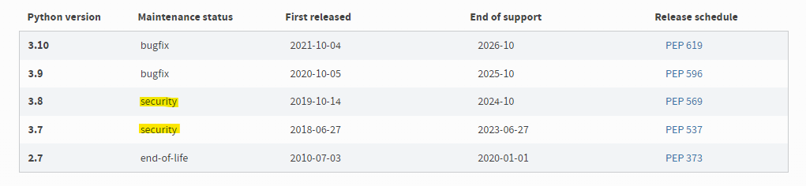

# Django

## Start

- 장고와 서버에 대한 개념은 앞에서 간단히 이야기를 전달 했습니다.

- 이제 장고를 설치해 서버를 간단하게 돌려 보도록 하겠습니다.

- 하지만 기본적인 Python은 컴퓨터에 설치가 되어 있어야 Django를 설치 할수 있기 때문에 Python를 설치 해주세요.

- 저는 안전 바전인 Python 3.8.0을 사용하도록 하겠습니다.

> 잠깐 MAC 유저분들은 Brew가 필요할수도 있습니다.  
> /bin/bash -c "$(curl -fsSL https://raw.githubusercontent.com/Homebrew/install/HEAD/install.sh)” 타이핑을 통해 brew 설치를 해보시죠.  
> brew를 통해 git python을 설치
> brew install git  
> brew install python@3.8

<p align="center"></p>

### Python Venv

- 장고 설치 전, 개발 환경을 깔끔하게 관리하기 위해 가상환경을 설정 해보도록 하겠습니다

- Python 가상환경(Virtual Environment) 줄여서 `Venv`라고 많이 이야기 하는데, 이러한 `Venv`는 `local(컴퓨터)`에 설치 되어있는 환경에 영향을 줄이기 위해 사용합니다.

> 예를 들어 Django에서 Tensorflow 버전을 1.x 사용하기 위해 설치 하는것이 내 컴퓨터 전체 영향이 끼친다면 어우 상상만 해도 끔찍;;;

<p align="center"></p>

- 먼저 폴더를 만들어볼려고 합니다.

- `Window` 유저 분들은 Powershell을 실행해주시고, `mac` 유저분들은 terminal을 실행해주세요

```console

    mkdir 원하는 폴더명  // 폴더를 만드는 과정
    cd 원하는 폴더명  // 만든 폴더에 들어가는 과정

```

- 이제 폴더에서 가상환경을 설정 해보도록 하겠습니다.

```console
    python -m venv myvenv
```

- 이렇게 해당 명령어를 수행하면 `myvenv`라는 폴더가 만들어 집니다.

- 만약 `python -m venv 원하는 폴더명`으로 명령어를 수행하면 폴더 역시 `원하는 폴더명`으로 생성 됩니다.

- 이제 가상환경을 사용해보록 하겠습니다.

```console
    cd myvenv
    cd Scripts
    ./activate
```

- 만약 가상환경을 종료하고 싶다면 아래 명령어를 작성하시면 됩니다.

```console
    deactivate
```

- 위 명령어들을 치고나면 아래 그림과 같이 (myvenv)라는게 앞에 붙어있게 되었습니다
<p align="center"></p>

### Django install

- `python`을 설치하면 `pip`가 자동으로 설치가 됩니다. 하지만 혹시모르니 최신버전으로 업그레이드를 진행후 Django를 설치해보록 하겠습니다.

```console
    python -m pip install --upgrade pip
    pip install django
```

### Django Project Start

- 이제 `django`를 설치가 완료되었으니 해당 프로젝트를 시작해볼려고 합니다.

```console
    cd ..
    cd ..
    django-admin startproject firstproejct
```

- 이렇게 되면 폴더 구성이 아래와 같이 바뀌게 될겁니다.

```console
firstproject
├───manage.py
└───mysite
   ├───**init**.py
   ├───asgi.py
   ├───settings.py
   ├───urls.py
   └───wsgi.py
```

- 이제 `Django`를 실행 시켜보도록 하겠습니다

```console
    python manage.py runserver
```

<p align="center"></p>
