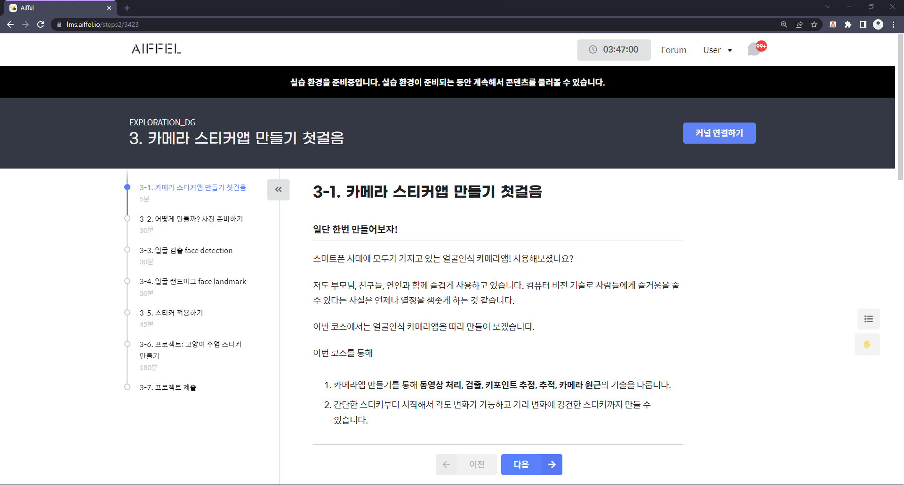
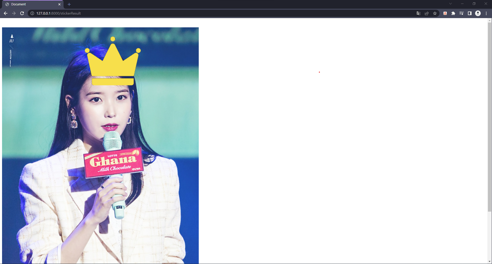
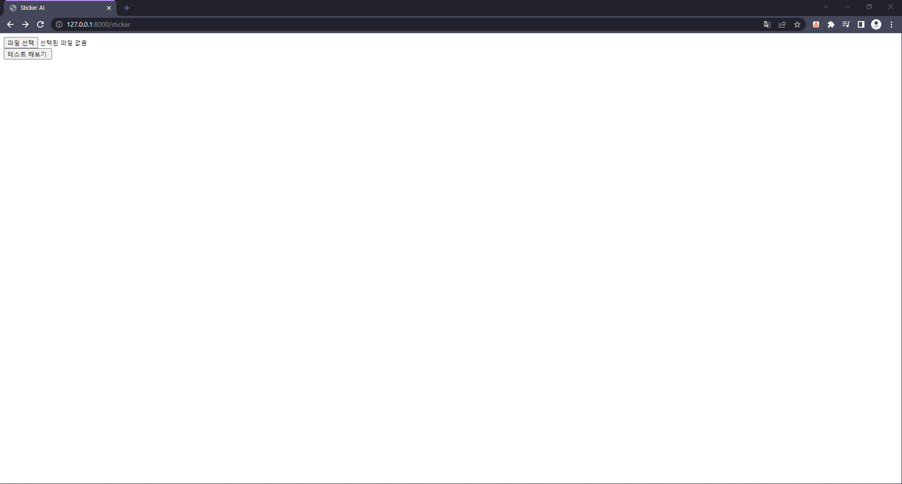

# Sticker

- 이번 시간에는 `Exploration` 3번에 있는 노드를 서버를 통해 `Web`에서 작동할수 있게 만들어 보도록 하겠습니다.
<p align="center"></p>
<p align="center"></p>

- 먼저 해당 챕터의 내용을 하기전에 폴더를 몇가지 만들도록 하겠습니다.

- 프로젝트 폴더 안에 `stickerUtil`라는 폴더를 만들어주도록 하겠습니다.

- 그리고 그안에 AI가 작동하는지 확인하기 위한 이미지를 담는 `images`와 `LandMark`모델을 담을 `models` 폴더를 만들어주도록 하겠습니다.

```console

fristproject
├───config
├───Landing
├───static
├───templatesasssssds
└───stickerUtil
    ├───images
    └───models
```

- 마지막으로 테스트로 사용될 `image.png` 와 스티커가 될 `king.png`를 넣어주면 됩니다 .

- `image.png` : 원하는 사람사진 한장으로 올려주시면 됩니다.

- `king.png` : https://drive.google.com/file/d/1knZtRmrsXVqYutibA9O06QVhFXb4oWl4/view?usp=sharing

```console

fristproject
├───config
├───Landing
├───static
├───templates
└───stickerUtil
    ├───images
    │   ├── image.png
    │   └── king.png
    └───models
```

- 그럼 스티커를 붙여주는 인공지능을 담당하는 코드는 `stickerUtil` 폴더안에 `sticker.py`라는 명칭으로 관리하도록 하겠습니다.

```console
fristproject
├───config
├───Landing
├───static
├───templates
└───stickerUtil
    ├───sticker.py
    ├───images
    │   ├── image.png
    │   └── king.png
    └───models
```

- 하지만 코드 작성 이전에 우리가 필요한 `library`들을 설치하도록 하겠습니다.

```py
pip install opencv-python
pip install matplotlib
pip install cmake
pip install dlib
```

> 여기서 `dlib`이 `window`에서 설치가 잘되지 않을수 있습니다.  
> [Dlib 설치 방법](https://sulastri.tistory.com/3)

- 먼저 `Exploration`에 있는 `스티커 붙이기` 챕터의 내용을 따라서 코드를 쳐보도록 하겠습니다.

```py
import os
import cv2
import matplotlib.pyplot as plt
import numpy as np
import dlib
print("🛸")
```

- 결과물이 `🛸`이 나오는것을 볼수 있습니다.

```py
my_image_path = os.path.dirname(__file__) +'/images/image.png'
my_image_path_encode= np.fromfile(my_image_path, np.uint8)
img_bgr = cv2.imdecode(my_image_path_encode,cv2.IMREAD_UNCHANGED)    # OpenCV로 이미지를 불러옵니다
img_show = img_bgr.copy()      # 출력용 이미지를 따로 보관합니다

plt.imshow(img_bgr)
plt.show()
```

- 해당 결과물로 우리가 지정한 사진이 나오는걸 확인할수 있습니다.

```py
detector_hog = dlib.get_frontal_face_detector()
img_rgb = cv2.cvtColor(img_bgr, cv2.COLOR_BGR2RGB)
dlib_rects = detector_hog(img_rgb, 1)   # (image, num of image pyramid)
    for dlib_rect in dlib_rects:
        l = dlib_rect.left()
        t = dlib_rect.top()
        r = dlib_rect.right()
        b = dlib_rect.bottom()

        cv2.rectangle(img_show, (l,t), (r,b), (0,255,0), 2, lineType=cv2.LINE_AA)

img_show_rgb =  cv2.cvtColor(img_show, cv2.COLOR_BGR2RGB)
plt.imshow(img_show_rgb)
plt.show()

```

- 자 이제 이미지 박스에 초록색 네모가 생기게 될거에요( 다들 알고 계시죠? ㅎㅎ )

- 이제 `Dlib`을 통해 `LandMark`를 세워보도록 하겠습니다.

- 먼저 아래 `URL`을 통해 `LandMark`파일을 설치하시고, 압축을 풀어 `shape_predictor_68_face_landmarks.dat`파일을 꺼내보도록 하겠습니다.

[LandMark](http://dlib.net/files/shape_predictor_68_face_landmarks.dat.bz2)

- `shape_predictor_68_face_landmarks.dat` 파일을 아래와 같이 넣어주도록 하겠습니다.

```console
fristproject
├───config
├───Landing
├───static
├───templates
└───stickerUtil
    ├───sticker.py
    ├───images
    │   ├─── image.png
    │   └─── king.png
    └───models
        └───shape_predictor_68_face_landmarks.dat
```

- `bounding box` 따라 랜드마크를 찍어주도록 하겠습니다.

- 이때 `model_path`는 한글경로가 있을경우 잘 돌아가지 않을수 있습니다.

```py
    # Section 4
    # LandMark 찍기
model_path = os.path.dirname(__file__) + '/models/shape_predictor_68_face_landmarks.dat'
landmark_predictor = dlib.shape_predictor(model_path)

list_landmarks = []
    # 얼굴 영역 박스 마다 face landmark를 찾아냅니다
    for dlib_rect in dlib_rects:
        points = landmark_predictor(img_rgb, dlib_rect)
        # face landmark 좌표를 저장해둡니다
        list_points = list(map(lambda p: (p.x, p.y), points.parts()))
        list_landmarks.append(list_points)
```

- 이제 `LandMark`가 제대로 찍혔는지 확인 해보도록 하겠습니다.

```py
  # Section 5
    # LandMark 출력

for landmark in list_landmarks:
    for point in landmark:
        cv2.circle(img_show, point, 2, (0, 255, 255), -1)

img_show_rgb = cv2.cvtColor(img_show, cv2.COLOR_BGR2RGB)
plt.imshow(img_show_rgb)
plt.show()
```

- `LandMark`가 찍히는게 확인이 되었으면 이제 스티커를 붙이고 정리 해보도록 하겠습니다.

```py
for dlib_rect, landmark in zip(dlib_rects, list_landmarks):
    x = landmark[30][0]
    y = landmark[30][1] - dlib_rect.height()//2
    w = h = dlib_rect.width()

    # 스티커 사이즈 조절
sticker_path = os.path.dirname(__file__) + '/images/king.png'
img_sticker = cv2.imread(sticker_path) # 스티커 이미지를 불러옵니다
img_sticker = cv2.resize(img_sticker, (w,h))

    # 스티커위치 조정
refined_x = x - w // 2
refined_y = y - h

    # 스티커 위치 넘어가면 잘리게
if refined_x < 0:
    img_sticker = img_sticker[:, -refined_x:]
    refined_x = 0
if refined_y < 0:
    img_sticker = img_sticker[-refined_y:, :]
    refined_y = 0

    # 사진에 적용후 출력
sticker_area = img_bgr[refined_y:refined_y +img_sticker.shape[0], refined_x:refined_x+img_sticker.shape[1]]
img_bgr[refined_y:refined_y +img_sticker.shape[0], refined_x:refined_x+img_sticker.shape[1]] = \
    np.where(img_sticker==0,sticker_area,img_sticker).astype(np.uint8)

plt.imshow(cv2.cvtColor(img_bgr, cv2.COLOR_BGR2RGB))
plt.show()
```

- 그럼 `python sticker.py`를 실행시키면 사진에 스티커가 붙여져서 나오는걸 확인 할수있습니다.

- 이제 장고에서 이미지를 받을수 있도록 사이트를 두개 만들도록 하겠습니다.

- 첫번째 사이트는 `input`을 통해 이미지를 받는역할을 하고 두번째 사이트는 `ouput`을 화면에 보여주는 역할을 합니다.

- 그럼 먼저 `html` 파일을 두개를 만들도록 하겠습니다.

- `stickerResult.html` : `image`를 보여주는 페이지입니다.

```html
<!DOCTYPE html>
<html lang="en">
  <head>
    <meta charset="UTF-8" />
    <meta http-equiv="X-UA-Compatible" content="IE=edge" />
    <meta name="viewport" content="width=device-width, initial-scale=1.0" />
    <title>Sticker AI view</title>
  </head>
  <body>
    <div>
      
    </div>
  </body>
</html>
```

- `sticker.html`: `input`태그를 통해 이미지를 받게 되는 페이지입니다.

```html
<!DOCTYPE html>
<html lang="en">
  <head>
    <meta charset="UTF-8" />
    <meta http-equiv="X-UA-Compatible" content="IE=edge" />
    <meta name="viewport" content="width=device-width, initial-scale=1.0" />
    <title>Sticker AI</title>
  </head>
  <body>
    <div class="container">
      <!-- form action을 통해 이미지가 전송이 되었을때 처리할 내용물이 전달이 되면 페이지 이동-->
      <form
        method="POST"
        action=""
        enctype="multipart/form-data"
      >
        
        <input type="file" name="image" /><br />
        <input type="submit" value="테스트 해보기 " />
      </form>
    </div>
  </body>
</html>
```

- 이제 `html`을 보여주는걸 담당하는 `views.py`에서 설정을 해주겠습니다.

- 일단 `sticker`는 단순하게 페이지만 보여주면 되기 때문에 아래와 같이 코드를 치면됩니다.

```py
# views.py
def sticker(req):
    return render(req,'Landing/sticker.html')

```

- `stickerResult`는 이미지에서 받은 값을 가공해서 다시 올려하기 때문에 여기서 차이가 있을수 있습니다.

- `POST`통신과 `GET` 통신에 대해선 앞서 `Figma`를 통해 설명을 드렸습니다.

- 이미지를 보낼수 있는건 `POST` 통신이기 때문에 해당 통신이 왔을때 이미지를 처리해서 `sticekrResult.html`에 보내도록 하겠습니다.

```py
# views.py
def stickerResult(request):
    if request.method == 'POST': # 통신이 post일때
        try:
            img = request.FILES["image"].read() # 통신에서 iamge를 읽어 드리도록 한다.
            convertImg = 인공지능 코드  # 인공지능 코드를 추가해야합니다.
            return render(request, 'Landing/stickerResult.html', {'image':convertImg}) # stickerResult.html을 보여줄때 가공한 image파일도 같이 넘긴다
        except:
            return   HttpResponse("보여줄 이미지가 없습니다!") # image 파일이 없으면 처리
    else:
        return   HttpResponse("보여줄 이미지가 없습니다!") # post 통신이 아니면 자료를 보낼수 없어서 예외 처리
```

- 마지막으로 이렇게 `views`에서 열심히 작성한 함수를 `urls.py`에서 연결시켜 보도록 하겠습니다.

```py
urlpatterns = [
    path('admin/', admin.site.urls),
    path('',Landing.views.index,name="index"),
    path('study',Landing.views.study,name="study"),
    path('sticker',Landing.views.sticker,name="sticker"), #스티커 입력하는 페이지
    path('stickerResult',Landing.views.stickerResult,name="stickerResult") #스티커 보여주는 페이지
]

```

- 이제 다시 인공지능 코드를 다듬을때가 왔습니다.

- 먼저 이제는 파이썬을 통해 이미지를 보여줄 필요가 없기 때문에 `plt.imshow`, `plt.show` 함수를 날리도록 하겠습니다.

- 그리고 `opencv`를 통해 가공한 이미지를 읽을수 있도록 변환해야 하기 때문에 몇가지 코드를 추가하도록 하겠습니다.

```py
import os
import cv2
import matplotlib.pyplot as plt
import numpy as np
import dlib
import base64

file_dir = os.path.dirname(__file__)

def stickerGen(img):
    img_bgr = cv2.imdecode(np.fromstring(img, np.uint8), cv2.IMREAD_UNCHANGED)
    detector_hog = dlib.get_frontal_face_detector()

    img_rgb = cv2.cvtColor(img_bgr, cv2.COLOR_BGR2RGB)
    dlib_rects = detector_hog(img_rgb, 1)

    model_path = file_dir+'/models/shape_predictor_68_face_landmarks.dat'
    landmark_predictor = dlib.shape_predictor(model_path)

    list_landmarks = []

    for dlib_rect in dlib_rects:
        points = landmark_predictor(img_rgb, dlib_rect)
        list_points = list(map(lambda p: (p.x, p.y), points.parts()))
        list_landmarks.append(list_points)

    for dlib_rect, landmark in zip(dlib_rects, list_landmarks):
        x = landmark[30][0]
        y = landmark[30][1] - dlib_rect.height()//2
        w = h = dlib_rect.width()

    sticker_path = file_dir+'/images/king.png'
    img_sticker = cv2.imread(sticker_path)
    img_sticker = cv2.resize(img_sticker, (w,h))

    refined_x = x - w // 2
    refined_y = y - h

    if refined_x < 0:
        img_sticker = img_sticker[:, -refined_x:]
        refined_x = 0
    if refined_y < 0:
        img_sticker = img_sticker[-refined_y:, :]
        refined_y = 0

    sticker_area = img_bgr[refined_y:refined_y +img_sticker.shape[0], refined_x:refined_x+img_sticker.shape[1]]
    img_bgr[refined_y:refined_y +img_sticker.shape[0], refined_x:refined_x+img_sticker.shape[1]] = \
        np.where(img_sticker==0,sticker_area,img_sticker).astype(np.uint8)

    img_bgr_buffer= cv2.imencode('.jpg', img_bgr)[1]
    result = base64.b64encode(img_bgr_buffer).decode("utf-8")
    return result

```

- 해당 코드를 위와 같이 수정하시고 `views.py`에서 인공지능을 보여주는 코드 역시 아래와 같이 바꿔주도록 합시다.

```py
from django.shortcuts import render
from django.core.files.storage import default_storage
# httpResponse를 위해 임포트
from django.http import HttpResponse
# 인공지능을 관리하는 코드 임포트
from stickerUtil.sticker import stickerGen


# Create your views here.
#views.py
def index(req):
    return render(req,'Landing/index.html')

def sticker(req):
    return render(req,'Landing/sticker.html')

def study(req):
    return render(req,'Landing/study.html')


def stickerResult(request):
    if request.method == 'POST': # 통신이 post일때
        try:
            imgMemory= request.FILES["image"] # 통신에서 iamge를 inmemory에 저장되어 있는 값으로 읽어 드리도록 한다.
            imgByte = imgMemory.read() # 통신에서 iamge를 Byte로 읽어 드리도록 한다.
            convertImg = "data:image/jpg;base64, "+str(stickerGen(imgByte)) # Html img 태그에서 출력할수 있도록 base64 타입으로 변환
            return render(request, 'Landing/stickerResult.html', {'image':convertImg}) # stickerResult.html을 보여줄때 가공한 image파일도 같이 넘긴다
        except:
            return   HttpResponse("보여줄 이미지가 없습니다!") # image 파일이 없으면 처리
    else:
        return   HttpResponse("보여줄 이미지가 없습니다!") # post 통신이 아니면 자료를 보낼수 없어서 예외 처리
```

- 이제 서버를 실행시켜 잘작동하는지 확인해 보도록 하겠습니다.

```console
python manage.py runserver
```

- `http://127.0.0.1:8000/sticker`에 접속을 하시면 아래 사진처럼 버튼두개가 보이게 될겁니다.

<p align="center"></p>

- 파일 선택을 누르면 이미지를 선택할수 있게 되어 원하는 이미지를 찾아 넣어주시면 됩니다.

<p align="center"></p>

- 사진을 넣어주시면 사람 얼굴에 왕관이 있는것을 확인할수 있습니다.

<p align="center"></p>

## 그런데!

- 만약 여러분이 입력받은 사진과 처리한 사진을 저장해 컴퓨터에 남기고 싶다면 어떻게 해야할까요?

- 이 경우에는 2가지 방법이 있습니다.

  - 첫번째는 `DataBase`를 사용해 파일을 비롯해 우리가 사용해하는 자료들을 저장하는 것입니다.

  - 두번째는 `Django`에서 가벼운 파일정도를 저장하는 용도로 사용하는 `default_storage`를 사용하는것입니다.

- 오늘은 `default_storage`를 사용해 파일을 저장해보도록 하겠습니다.

- 이 과정은 크게 3가지로 `settings.py` , `urls.py`, `views.py`에서 작업을 해야합니다.

- 또한 스티커를 붙인 코드를 저장하기 위해서는 추가적으로 `cv2.imwrite()`함수를 추가적으로 해야합니다.

- `settings.py`에서 `default_storage`의 위치를 `media`라는 폴더로 선정해주도록 하겠습니다.

```py
# Base_DIR 까지는 우리가 작성했습니다.
BASE_DIR = Path(__file__).resolve().parent.parent.parent

# 이 밑에 media라는 디렉토리를 두어 저장소의 위치를 선정하겠습니다.
MEDIA_ROOT = BASE_DIR / 'media'
```

- `urls.py`에서 `media`파일을 자동으로 옮겨줄수 있도록 코드를 한줄 수정해주도록 하겠습니다.

```py
from django.contrib import admin
from django.urls import include,path
from django.conf import settings
from django.conf.urls.static import static
import Landing.views

urlpatterns = [
    path('admin/', admin.site.urls),
    path('',Landing.views.index,name="index"),
    path('study',Landing.views.study,name="study"),
    path('sticker',Landing.views.sticker,name="sticker"),
    path('stickerResult',Landing.views.stickerResult,name="stickerResult")
] + static(settings.MEDIA_URL, document_root=settings.MEDIA_ROOT)
```

- `views.py`에서 작성했던 `stickerResult` 함수에서 이미지를 받으면 `default_storage(media 폴더)`에 저장할수 있도록 코드를 추가해주겠습니다.

- 우리는 받은 이미지를 `media`폴더 안에 `bfImages`라는 곻간에 저장하도록 하겠습니다.

- 이작업을 수행하기 위해서는 `Django`에 `memory`에 올라와있는 파일을 저장해야합니다.

- 따라서 `imgMemory`를 통해서 사진을 바로 저장할수 있게 아래와 같이 작성하도록 하겠습니다.

- 수정된 코드

```py

def stickerResult(request):
    if request.method == 'POST': # 통신이 post일때
        try:
            imgMemory= request.FILES["image"] # 통신에서 iamge를 inmemory에 저장되어 있는 값으로 읽어 드리도록 한다.
            imgByte = imgMemory.read() # 통신에서 iamge를 Byte로 읽어 드리도록 한다.
            if default_storage.exists("bfImages/"+str(imgMemory)) == False:
                default_storage.save("bfImages/"+str(imgMemory), imgMemory)
            convertImg = "data:image/jpg;base64, "+str(stickerGen(img)) # Html img 태그에서 출력할수 있도록 base64 타입으로 변환
            return render(request, 'Landing/stickerResult.html', {'image':convertImg}) # stickerResult.html을 보여줄때 가공한 image파일도 같이 넘긴다
        except:
            return   HttpResponse("보여줄 이미지가 없습니다!") # image 파일이 없으면 처리
    else:
        return   HttpResponse("보여줄 이미지가 없습니다!") # post 통신이 아니면 자료를 보낼수 없어서 예외 처리
```

- 여기서 몇몇 분들은 `requset`와 `default_stroage`에서 파일을 읽는 과정에서 여러가지 함수들을 적용 시킬수 있다는을 느끼셨을건데 차이는 아래와 같습니다.

```py
    #request
    print(type(request.FILES["file"]))              #<class 'django.core.files.uploadedfile.InMemoryUploadedFile'>

    print(type(request.FILES.get('file')))          #<class 'django.core.files.uploadedfile.InMemoryUploadedFile'>

    print(request.FILES.get('file'))                #bank.png

    imageFile = request.FILES.get('file')

    print(imageFile.size)                           #119227

    print(request.FILES.get('file').name)           #bank.png

    print(request.FILES.get('file').content_type)   #image/png

    print(type(request.FILES.get('file').open()))   #<class 'NoneType'>

    print(request.FILES.get('file').open())         #None

    #default_storage
    path = default_storage.save('path/to/file', file) # 지정된 경로에 파일 저장

    default_storage.size(path) # 파일 전체 크기(byte)

    default_storage.open(path).read() # 지정된 파일 열기

    default_storage.delete(path) # 지정된 파일 삭제

    default_storage.exists(path) # 지정된 파일 존재 여부 (False || True)
```

- 이 작업을 수행하고 똑같이 사이트를 이용해 보면 `media`라는 폴더가 생기게 되고 `bfimages`라는 폴더안에 사진이 들어간것을 확인할수 있습니다.

- 마지막으로 스티커를 붙인 사진을 저장하기 위해 `sticker.py`에서 사진을 저장하는 기능을 추가 해야합니다.

- 사진을 저장하는 코드는 아래와 같은데 저 코드를 어딘가에 삽입해서 `media`에 `afImages`라는 폴더를 만들고 그안에 저장하도록 만들어 보는것을 숙제로 내도록 하겠습니다.

```py
cv2.imwrite("경로/afImages/파일명.jpg", img_bgr)

```
